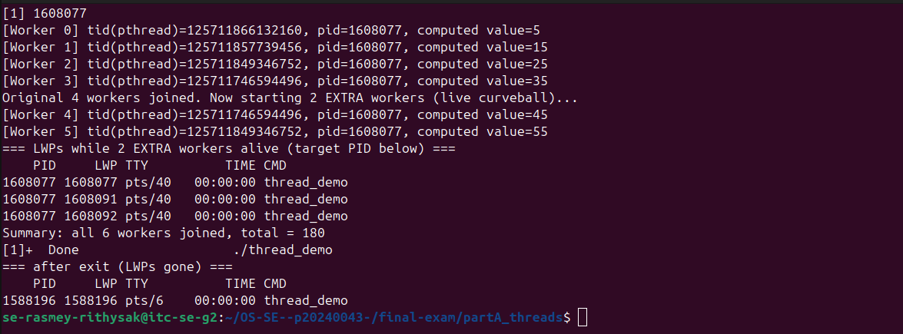
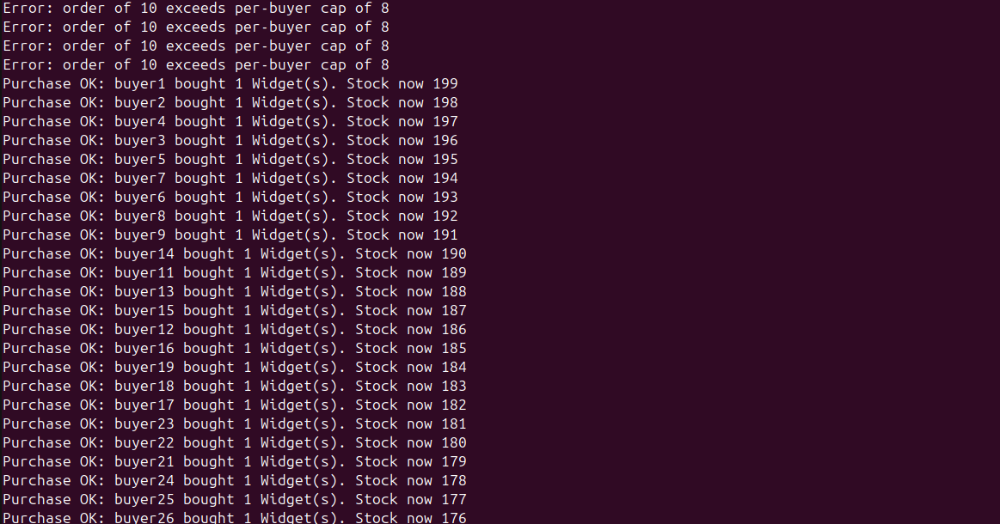
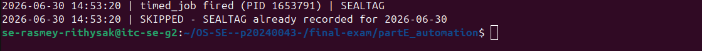

# live_mods.md — Live Modification (curveball) answers

> Released once, late in the exam. **Three curveballs: A, D, E.** For EACH, give: the
> announced instruction, the exact command(s) you ran, the **live value(s)** you acted
> on (your PID / stock / timestamp), and the screenshot. An answer that ignores your
> issued value, or that could have been written *before* the announcement, scores zero.

---

## Curveball A — extra worker(s) that start after the others join

- **Issued value:** `<N>` extra worker(s)
- **Announced instruction:** <paste exactly what was announced>
- **Live value(s) I acted on:** base PID = `<...>`; new LWP id(s) that appeared = `<...>`
- **Commands:**

```bash
# edit thread_demo.c to spawn N extra workers only AFTER the originals join
# recompile, run, and capture the mapping showing the new LWP(s) appear then vanish
## Part A — Live curveball (2 extra workers)
Value: 2 extra worker(s), spawned only after original 4 joined.

Command run:
./thread_demo &
sleep 1.3
ps -L -p $(pgrep -xn thread_demo)
wait
ps -L -p $(pgrep -xn thread_demo) 2>/dev/null || echo "no thread_demo LWPs remain"

Evidence: mid-run capture showed exactly 3 LWPs for the target PID (main + 2 new
extra workers) — the original 4 worker LWPs had already terminated after joining.
After full exit, zero LWPs remained for that PID, confirming the 2 extra threads'
kernel-level LWPs appeared after the originals joined and disappeared after exit.
Screenshot: partA_threads/images/live_a.png
```

- **Screenshot:**



---

## Curveball D — per-buyer purchase cap

- **Issued value:** cap = `<N>`
- **Announced instruction:** <paste>
- **Live value(s) I acted on:** stock before = `<...>`; order(s) rejected for exceeding
  the cap = `<...>`; final stock = `<...>`
- **Commands:**

```bash
# add a per-buyer cap to buy_<product>: reject any single order above <N>
# reset stock, re-run swarm, show it stays consistent AND respects the cap
## Part D — Live curveball (per-buyer cap = 8)
Value: cap = 8 units per single order.

Command run:
nano scripts/buy_widget   # added PURCHASE_CAP=8 check before the locked critical section
echo 200 > stock.txt
./scripts/buy_widget Alice 5
./scripts/buy_widget Bob 8
./scripts/buy_widget Carol 9
./scripts/swarm   # modified: every 10th of 40 buyers orders qty=10 (over cap)

Evidence: manual test showed orders of 5 and 8 succeed, order of 9 correctly
rejected with "exceeds per-buyer cap of 8" and stock left unchanged. Under
concurrency (swarm), 3 separate runs all landed at exactly stock=164 with
exactly 4 rejected orders (the 4 buyers requesting qty=10), proving the cap
check and the flock lock both hold correctly together even under 40 concurrent
processes.
Screenshot: partD_secure/images/live_d.png
```

- **Screenshot:**



---

## Curveball E — idempotent timed_job

- **Issued value:** token = `<TOKEN>`
- **Announced instruction:** <paste>
- **Live value(s) I acted on:** today's marker line = `<...>`; 1st trigger = ran,
  2nd trigger = skipped
- **Commands:**

```bash
# add a guard to timed_job: refuse to run if today's <TOKEN> entry is already in the log
# trigger it twice and show the 2nd run was skipped
## Part E — Live curveball (idempotency, token = SEALTAG)
Value: token = SEALTAG

Command run:
nano scripts/timed_job   # added today-date + SEALTAG check via grep before writing
chmod +x scripts/timed_job
rm -f logs/idempotent_test.log
./scripts/timed_job logs/idempotent_test.log
./scripts/timed_job logs/idempotent_test.log
cat logs/idempotent_test.log

Evidence: first invocation wrote "timed_job fired ... | SEALTAG" to the log.
Second invocation, run immediately after, detected today's date + SEALTAG
already present via grep and wrote "SKIPPED - SEALTAG already recorded for
2026-06-30" instead of firing again — proving the job is idempotent per day.
Screenshot: partE_automation/images/live_e.png
```

- **Screenshot:**


