# Class Activity 1 — System Calls in Practice

- **Student Name:** Rasmey Rithysak
- **Student ID:** p20240043
- **Date:** March 19, 2025

---

## Warm-Up: Hello System Call

Screenshot of running `hello_syscall.c` on Linux:

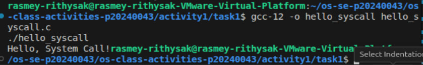

Screenshot of running `copyfilesyscall.c` on Linux:

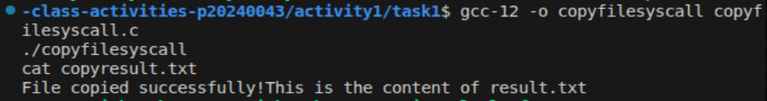

---

## Task 1: File Creator & Reader

### Part A — File Creator

**Describe your implementation:** The library version uses `fopen()` and `fprintf()` which are high-level C functions. The syscall version uses `open()`, `write()`, and `close()` directly — no buffering, no formatting, just raw kernel calls.

**Version A — Library Functions (`file_creator_lib.c`):**

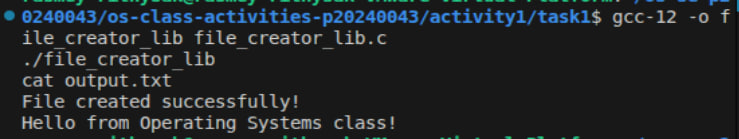

**Version B — POSIX System Calls (`file_creato# Class Activity 1 — System Calls in Practice

- **Student Name:** Rasmey Rithysak
- **Student ID:** p20240043
- **Date:** March 19, 2025

---

## Warm-Up: Hello System Call

Screenshot of running `hello_syscall.c` on Linux:

Screenshot of running `copyfilesyscall.c` on Linux:

---

## Task 1: File Creator & Reader

### Part A — File Creator

**Describe your implementation:** The library version uses `fopen()` and `fprintf()` which are high-level C functions. The syscall version uses `open()`, `write()`, and `close()` directly — no buffering, no formatting, just raw kernel calls.

**Version A — Library Functions (`file_creator_lib.c`):**

**Version B — POSIX System Calls (`file_creator_sys.c`):**

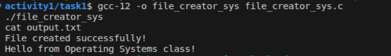

**Questions:**

1. **What flags did you pass to `open()`? What does each flag mean?**

   > I passed `O_WRONLY | O_CREAT | O_TRUNC`. `O_WRONLY` means open for writing only. `O_CREAT` means create the file if it doesn't exist. `O_TRUNC` means erase the file content if it already exists.

2. **What is `0644`? What does each digit represent?**

   > `0644` is the file permission in octal. The first `0` means it's octal. `6` means the owner can read and write. `4` means the group can read only. `4` means others can read only.

3. **What does `fopen("output.txt", "w")` do internally that you had to do manually?**

   > `fopen()` internally calls `open()` with the correct flags automatically. I had to manually specify `O_WRONLY | O_CREAT | O_TRUNC` and the permission `0644` myself.

### Part B — File Reader & Display

**Describe your implementation:** The library version uses `fgets()` to read line by line. The syscall version uses `read()` in a loop and `write()` to print directly to the terminal.

**Version A — Library Functions (`file_reader_lib.c`):**

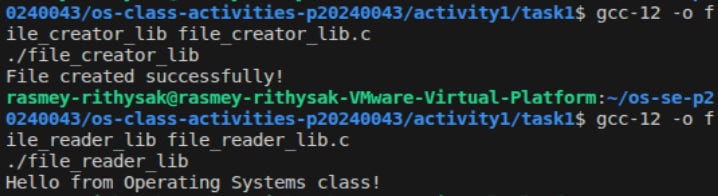

**Version B — POSIX System Calls (`file_reader_sys.c`):**

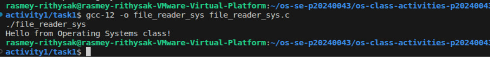

**Questions:**

1. **What does `read()` return? How is this different from `fgets()`?**

   > `read()` returns the number of bytes actually read, or `0` at end of file, or `-1` on error. `fgets()` returns a pointer to the buffer or `NULL` at end of file — it handles newlines and string termination automatically, while `read()` just gives raw bytes.

2. **Why do you need a loop when using `read()`? When does it stop?**

   > Because `read()` may not read the entire file in one call — it reads up to the buffer size. The loop keeps reading until `read()` returns `0`, which means end of file.

---

## Task 2: Directory Listing & File Info

**Describe your implementation:** The library version uses `printf()` to print output. The syscall version uses `snprintf()` to format the text into a buffer first, then `write()` to print it to the terminal.

### Version A — Library Functions (`dir_list_lib.c`)

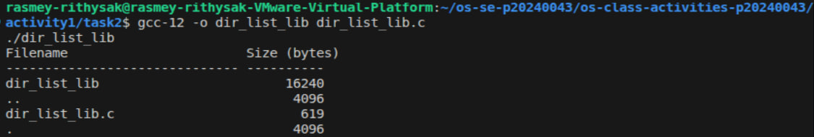

### Version B — System Calls (`dir_list_sys.c`)

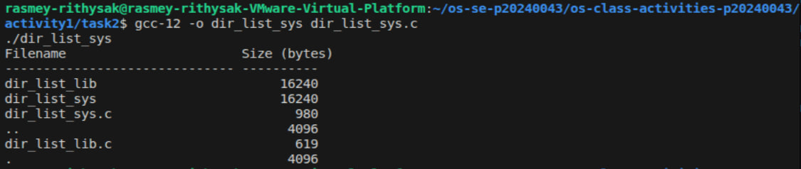

### Questions

1. **What struct does `readdir()` return? What fields does it contain?**

   > `readdir()` returns a pointer to a `struct dirent`. It contains fields like `d_name` (the filename), `d_ino` (inode number), `d_type` (file type), and `d_reclen` (record length).

2. **What information does `stat()` provide beyond file size?**

   > `stat()` provides file permissions, owner user ID, group ID, number of hard links, last access time, last modification time, last status change time, and the inode number.

3. **Why can't you `write()` a number directly — why do you need `snprintf()` first?**

   > `write()` only works with raw bytes/strings. Numbers are stored as integers in memory, not as text. `snprintf()` converts the number into a string first so `write()` can print it properly.

---

## Task 3: strace Analysis

**Describe what you observed:** The library version made 38 total system calls while the syscall version made only 33. The library version had extra calls like `fstat`, `brk`, `mmap` which are used for memory management and buffering behind the scenes.

### strace Output — Library Version (File Creator)

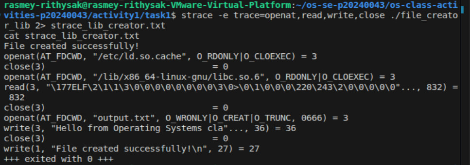

### strace Output — System Call Version (File Creator)

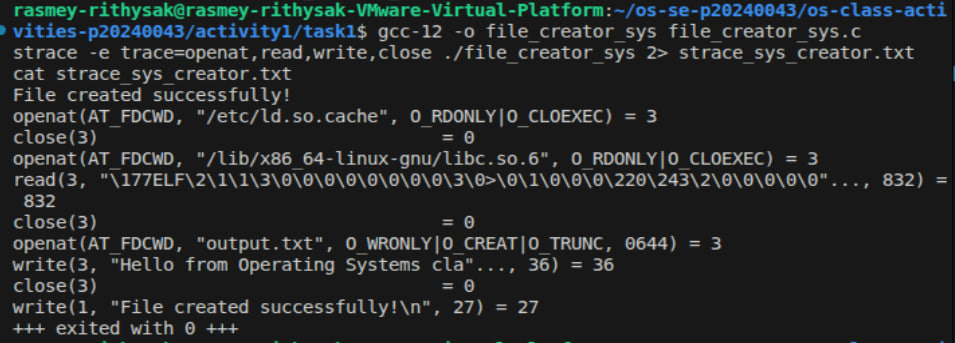

### strace Output — Library Version (File Reader)

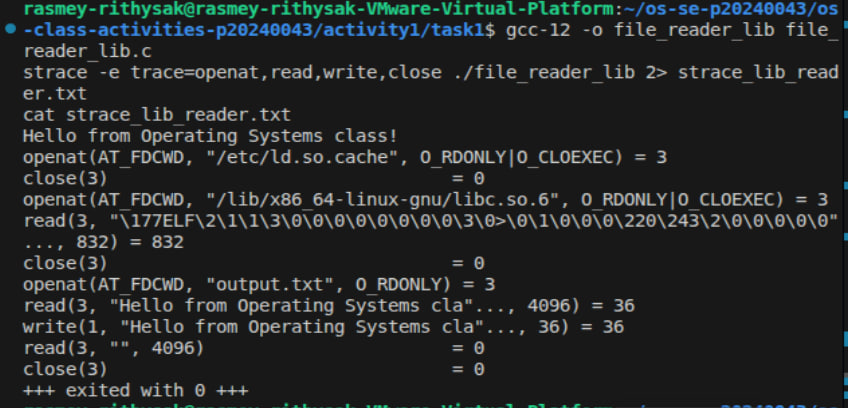

### strace Output — System Call Version (File Reader)

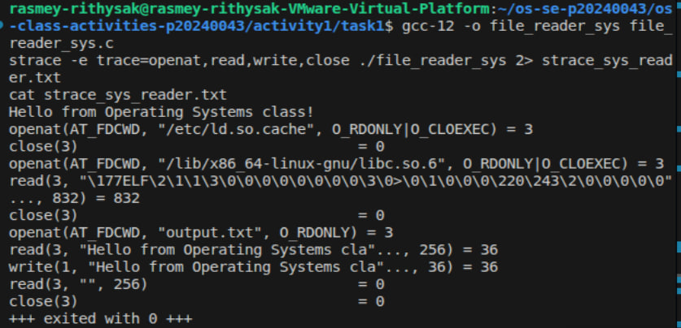

### strace -c Summary Comparison

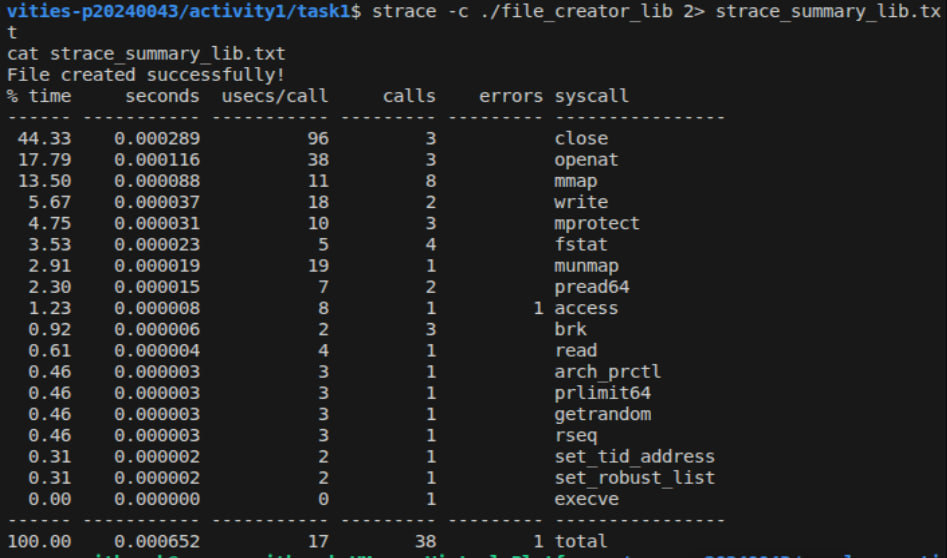
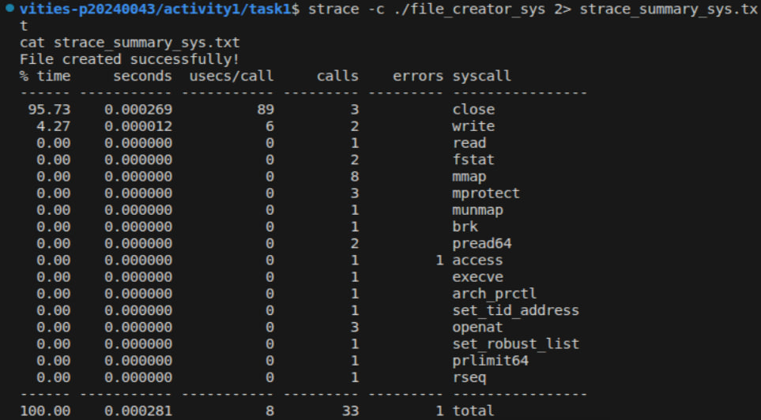

### Questions

1. **How many system calls does the library version make compared to the system call version?**

   > The library version made 38 total system calls. The syscall version made 33 total system calls.

2. **What extra system calls appear in the library version? What do they do?**

   > The library version has extra calls like `mmap` (maps memory regions), `brk` (manages heap memory), `fstat` (gets file status for buffering), and `mprotect` (sets memory protection). These are used by the C library for internal memory management and I/O buffering.

3. **How many `write()` calls does `fprintf()` actually produce?**

   > `fprintf()` produced 1 `write()` system call. The C library buffers the output and sends it all at once.

4. **In your own words, what is the real difference between a library function and a system call?**# Class Activity 1 — System Calls in Practice

- **Student Name:** Rasmey Rithysak
- **Student ID:** p20240043
- **Date:** March 19, 2025

---

## Warm-Up: Hello System Call

Screenshot of running `hello_syscall.c` on Linux:

Screenshot of running `copyfilesyscall.c` on Linux:

---

## Task 1: File Creator & Reader

### Part A — File Creator

**Describe your implementation:** The library version uses `fopen()` and `fprintf()` which are high-level C functions. The syscall version uses `open()`, `write()`, and `close()` directly — no buffering, no formatting, just raw kernel calls.

**Version A — Library Functions (`file_creator_lib.c`):**

**Version B — POSIX System Calls (`file_creator_sys.c`):**

**Questions:**

1. **What flags did you pass to `open()`? What does each flag mean?**

   > I passed `O_WRONLY | O_CREAT | O_TRUNC`. `O_WRONLY` means open for writing only. `O_CREAT` means create the file if it doesn't exist. `O_TRUNC` means erase the file content if it already exists.

2. **What is `0644`? What does each digit represent?**

   > `0644` is the file permission in octal. The first `0` means it's octal. `6` means the owner can read and write. `4` means the group can read only. `4` means others can read only.

3. **What does `fopen("output.txt", "w")` do internally that you had to do manually?**

   > `fopen()` internally calls `open()` with the correct flags automatically. I had to manually specify `O_WRONLY | O_CREAT | O_TRUNC` and the permission `0644` myself.

### Part B — File Reader & Display

**Describe your implementation:** The library version uses `fgets()` to read line by line. The syscall version uses `read()` in a loop and `write()` to print directly to the terminal.

**Version A — Library Functions (`file_reader_lib.c`):**

**Version B — POSIX System Calls (`file_reader_sys.c`):**

**Questions:**

1. **What does `read()` return? How is this different from `fgets()`?**

   > `read()` returns the number of bytes actually read, or `0` at end of file, or `-1` on error. `fgets()` returns a pointer to the buffer or `NULL` at end of file — it handles newlines and string termination automatically, while `read()` just gives raw bytes.

2. **Why do you need a loop when using `read()`? When does it stop?**

   > Because `read()` may not read the entire file in one call — it reads up to the buffer size. The loop keeps reading until `read()` returns `0`, which means end of file.

---

## Task 2: Directory Listing & File Info

**Describe your implementation:** The library version uses `printf()` to print output. The syscall version uses `snprintf()` to format the text into a buffer first, then `write()` to print it to the terminal.

### Version A — Library Functions (`dir_list_lib.c`)

### Version B — System Calls (`dir_list_sys.c`)

### Questions

1. **What struct does `readdir()` return? What fields does it contain?**

   > `readdir()` returns a pointer to a `struct dirent`. It contains fields like `d_name` (the filename), `d_ino` (inode number), `d_type` (file type), and `d_reclen` (record length).

2. **What information does `stat()` provide beyond file size?**

   > `stat()` provides file permissions, owner user ID, group ID, number of hard links, last access time, last modification time, last status change time, and the inode number.

3. **Why can't you `write()` a number directly — why do you need `snprintf()` first?**

   > `write()` only works with raw bytes/strings. Numbers are stored as integers in memory, not as text. `snprintf()` converts the number into a string first so `write()` can print it properly.

---

## Task 3: strace Analysis

**Describe what you observed:** The library version made 38 total system calls while the syscall version made only 33. The library version had extra calls like `fstat`, `brk`, `mmap` which are used for memory management and buffering behind the scenes.

### strace Output — Library Version (File Creator)

### strace Output — System Call Version (File Creator)

### strace Output — Library Version (File Reader)

### strace Output — System Call Version (File Reader)

### strace -c Summary Comparison

### Questions

1. **How many system calls does the library version make compared to the system call version?**

   > The library version made 38 total system calls. The syscall version made 33 total system calls.

2. **What extra system calls appear in the library version? What do they do?**

   > The library version has extra calls like `mmap` (maps memory regions), `brk` (manages heap memory), `fstat` (gets file status for buffering), and `mprotect` (sets memory protection). These are used by the C library for internal memory management and I/O buffering.

3. **How many `write()` calls does `fprintf()` actually produce?**

   > `fprintf()` produced 1 `write()` system call. The C library buffers the output and sends it all at once.

4. **In your own words, what is the real difference between a library function and a system call?**

   > A library function like `printf()` or `fopen()` is a wrapper that does extra work like buffering and formatting before eventually calling the actual system call. A system call goes directly to the kernel with no extra overhead. Library functions are easier to use but make more system calls behind the scenes.

---

## Task 4: Exploring OS Structure

### System Information

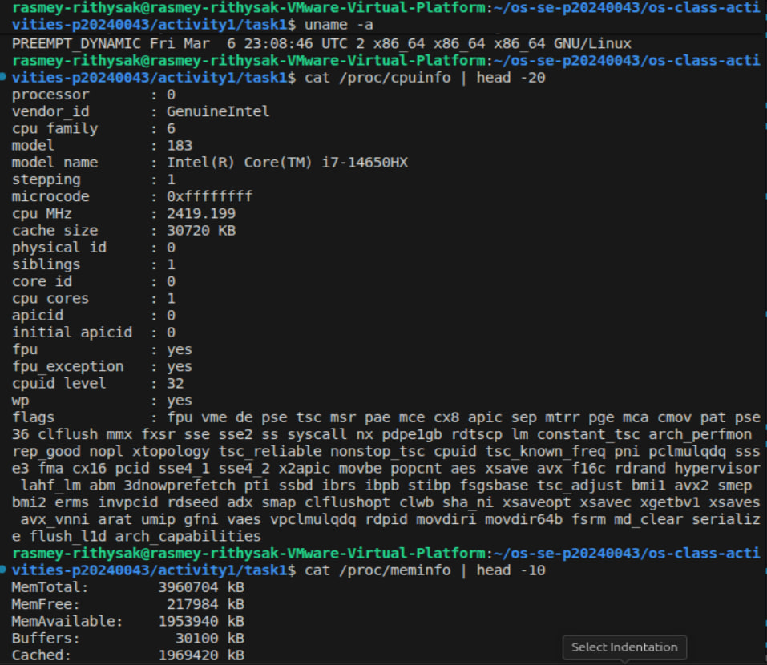
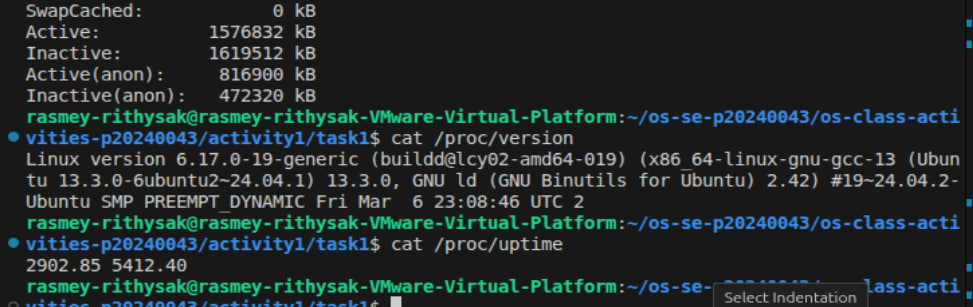

### Process Information

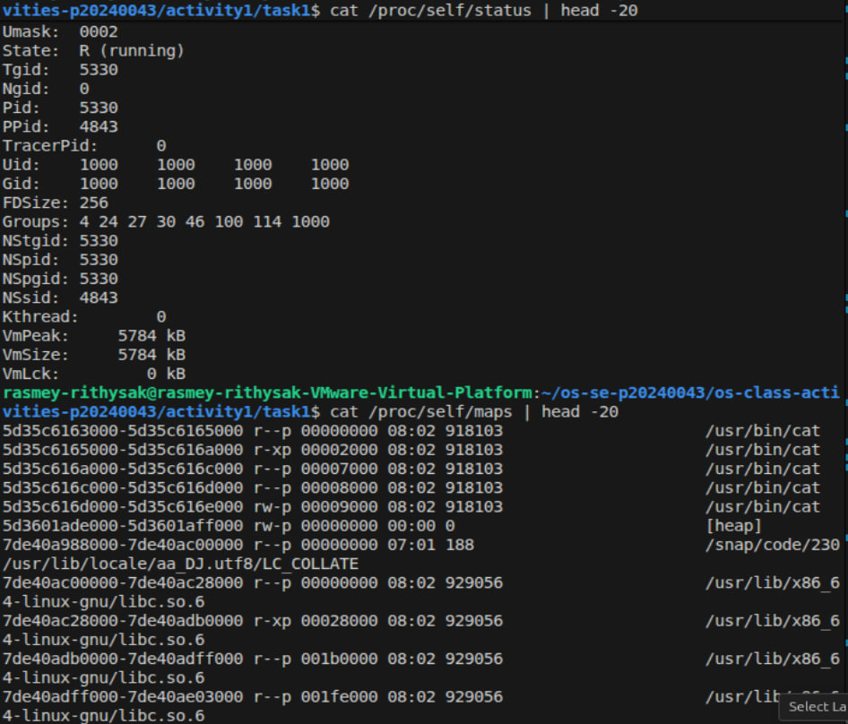
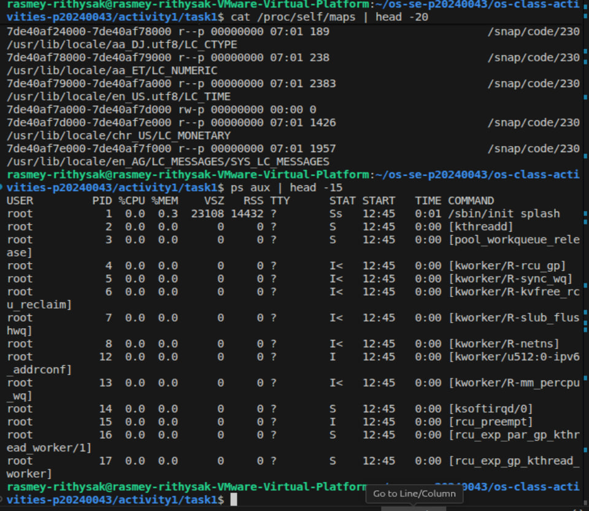

### Kernel Modules

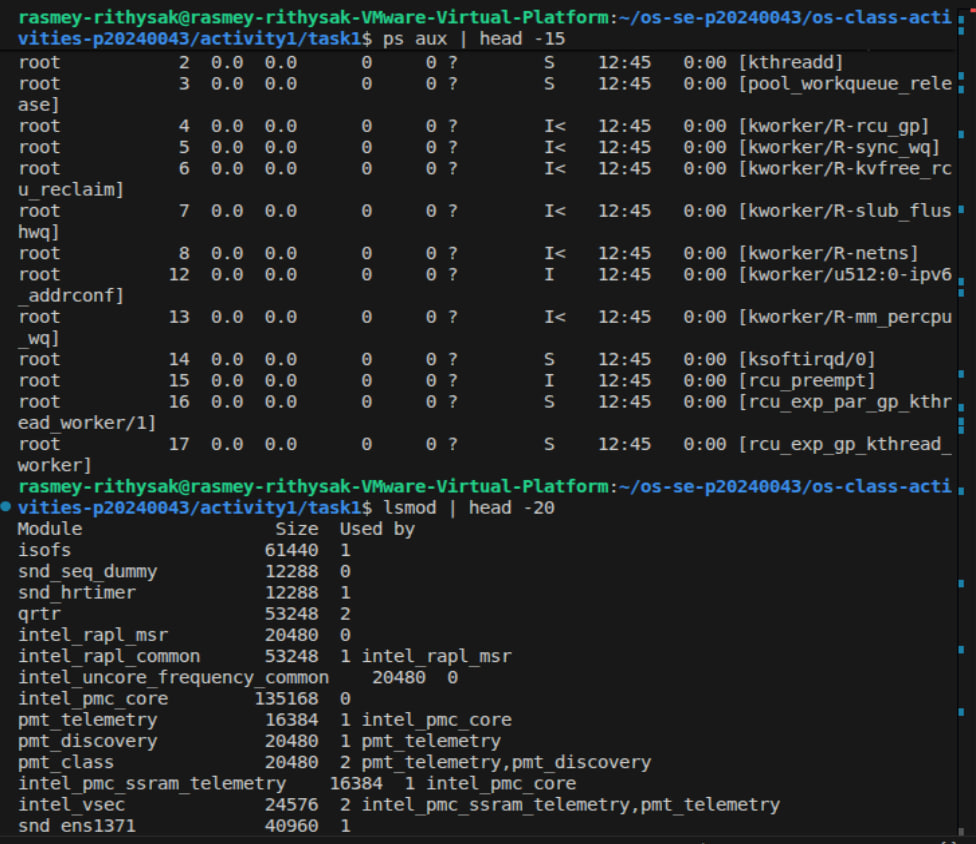

### OS Layers Diagram

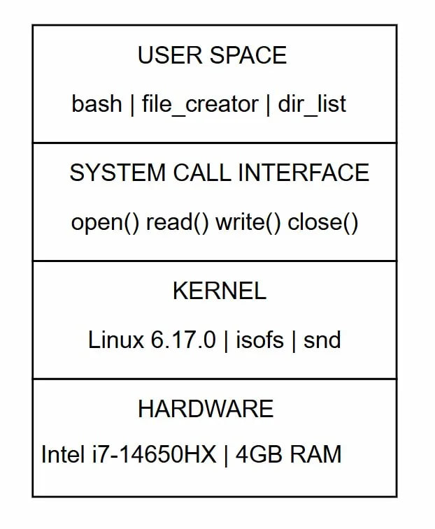

### Questions

1. **What is `/proc`? Is it a real filesystem on disk?**

   > `/proc` is a virtual filesystem. It is not stored on disk — the kernel generates its contents on the fly when you read them. It exposes real-time information about the system like CPU, memory, and running processes.
# Class Activity 1 — System Calls in Practice

- **Student Name:** Rasmey Rithysak
- **Student ID:** p20240043
- **Date:** March 19, 2025

---

## Warm-Up: Hello System Call

Screenshot of running `hello_syscall.c` on Linux:

Screenshot of running `copyfilesyscall.c` on Linux:

---

## Task 1: File Creator & Reader

### Part A — File Creator

**Describe your implementation:** The library version uses `fopen()` and `fprintf()` which are high-level C functions. The syscall version uses `open()`, `write()`, and `close()` directly — no buffering, no formatting, just raw kernel calls.

**Version A — Library Functions (`file_creator_lib.c`):**

**Version B — POSIX System Calls (`file_creator_sys.c`):**

**Questions:**

1. **What flags did you pass to `open()`? What does each flag mean?**

   > I passed `O_WRONLY | O_CREAT | O_TRUNC`. `O_WRONLY` means open for writing only. `O_CREAT` means create the file if it doesn't exist. `O_TRUNC` means erase the file content if it already exists.

2. **What is `0644`? What does each digit represent?**

   > `0644` is the file permission in octal. The first `0` means it's octal. `6` means the owner can read and write. `4` means the group can read only. `4` means others can read only.

3. **What does `fopen("output.txt", "w")` do internally that you had to do manually?**

   > `fopen()` internally calls `open()` with the correct flags automatically. I had to manually specify `O_WRONLY | O_CREAT | O_TRUNC` and the permission `0644` myself.

### Part B — File Reader & Display

**Describe your implementation:** The library version uses `fgets()` to read line by line. The syscall version uses `read()` in a loop and `write()` to print directly to the terminal.

**Version A — Library Functions (`file_reader_lib.c`):**

**Version B — POSIX System Calls (`file_reader_sys.c`):**

**Questions:**

1. **What does `read()` return? How is this different from `fgets()`?**

   > `read()` returns the number of bytes actually read, or `0` at end of file, or `-1` on error. `fgets()` returns a pointer to the buffer or `NULL` at end of file — it handles newlines and string termination automatically, while `read()` just gives raw bytes.

2. **Why do you need a loop when using `read()`? When does it stop?**

   > Because `read()` may not read the entire file in one call — it reads up to the buffer size. The loop keeps reading until `read()` returns `0`, which means end of file.

---

## Task 2: Directory Listing & File Info

**Describe your implementation:** The library version uses `printf()` to print output. The syscall version uses `snprintf()` to format the text into a buffer first, then `write()` to print it to the terminal.

### Version A — Library Functions (`dir_list_lib.c`)

### Version B — System Calls (`dir_list_sys.c`)

### Questions

1. **What struct does `readdir()` return? What fields does it contain?**

   > `readdir()` returns a pointer to a `struct dirent`. It contains fields like `d_name` (the filename), `d_ino` (inode number), `d_type` (file type), and `d_reclen` (record length).

2. **What information does `stat()` provide beyond file size?**

   > `stat()` provides file permissions, owner user ID, group ID, number of hard links, last access time, last modification time, last status change time, and the inode number.

3. **Why can't you `write()` a number directly — why do you need `snprintf()` first?**

   > `write()` only works with raw bytes/strings. Numbers are stored as integers in memory, not as text. `snprintf()` converts the number into a string first so `write()` can print it properly.

---

## Task 3: strace Analysis

**Describe what you observed:** The library version made 38 total system calls while the syscall version made only 33. The library version had extra calls like `fstat`, `brk`, `mmap` which are used for memory management and buffering behind the scenes.

### strace Output — Library Version (File Creator)

### strace Output — System Call Version (File Creator)

### strace Output — Library Version (File Reader)

### strace Output — System Call Version (File Reader)

### strace -c Summary Comparison

### Questions

1. **How many system calls does the library version make compared to the system call version?**

   > The library version made 38 total system calls. The syscall version made 33 total system calls.

2. **What extra system calls appear in the library version? What do they do?**

   > The library version has extra calls like `mmap` (maps memory regions), `brk` (manages heap memory), `fstat` (gets file status for buffering), and `mprotect` (sets memory protection). These are used by the C library for internal memory management and I/O buffering.

3. **How many `write()` calls does `fprintf()` actually produce?**

   > `fprintf()` produced 1 `write()` system call. The C library buffers the output and sends it all at once.

4. **In your own words, what is the real difference between a library function and a system call?**

   > A library function like `printf()` or `fopen()` is a wrapper that does extra work like buffering and formatting before eventually calling the actual system call. A system call goes directly to the kernel with no extra overhead. Library functions are easier to use but make more system calls behind the scenes.

---

## Task 4: Exploring OS Structure

### System Information

### Process Information

### Kernel Modules

### OS Layers Diagram

### Questions

1. **What is `/proc`? Is it a real filesystem on disk?**

   > `/proc` is a virtual filesystem. It is not stored on disk — the kernel generates its contents on the fly when you read them. It exposes real-time information about the system like CPU, memory, and running processes.

2. **Monolithic kernel vs. microkernel — which type does Linux use?**

   > Linux uses a monolithic kernel, meaning all kernel services run in kernel space. However it is modular — you can load and unload modules at runtime using `lsmod`, which we can see with modules like `isofs` and `snd_ens1371`.

3. **What memory regions do you see in `/proc/self/maps`?**

   > I can see the executable code region (`/usr/bin/cat`), the heap (`[heap]`), shared libraries (`libc.so.6`), and memory-mapped files for locale data.

4. **Break down the kernel version string from `uname -a`.**

   > `Linux` — OS name. `rasmey-rithysak-VMware-Virtual-Platform` — hostname. `6.17.0-19-generic` — kernel version. `#19~24.04.2-Ubuntu` — build number and distro. `SMP PREEMPT_DYNAMIC` — supports multiple processors and dynamic preemption. `Fri Mar 6 23:08:46 UTC 2` — build date. `x86_64` — 64-bit architecture.

5. **How does `/proc` show that the OS is an intermediary between programs and hardware?**

   > `/proc` shows that user programs cannot access hardware directly — they must go through the kernel. When a program reads `/proc/cpuinfo`, the kernel fetches the real CPU data and returns it. This proves the OS sits between user programs and hardware.# Class Activity 1 — System Calls in Practice

- **Student Name:** Rasmey Rithysak
- **Student ID:** p20240043
- **Date:** March 19, 2025

---

## Warm-Up: Hello System Call

Screenshot of running `hello_syscall.c` on Linux:

Screenshot of running `copyfilesyscall.c` on Linux:

---

## Task 1: File Creator & Reader

### Part A — File Creator

**Describe your implementation:** The library version uses `fopen()` and `fprintf()` which are high-level C functions. The syscall version uses `open()`, `write()`, and `close()` directly — no buffering, no formatting, just raw kernel calls.

**Version A — Library Functions (`file_creator_lib.c`):**

**Version B — POSIX System Calls (`file_creator_sys.c`):**

# Class Activity 1 — System Calls in Practice

- **Student Name:** Rasmey Rithysak
- **Student ID:** p20240043
- **Date:** March 19, 2025

---

## Warm-Up: Hello System Call

Screenshot of running `hello_syscall.c` on Linux:

Screenshot of running `copyfilesyscall.c` on Linux:

---

## Task 1: File Creator & Reader

### Part A — File Creator

**Describe your implementation:** The library version uses `fopen()` and `fprintf()` which are high-level C functions. The syscall version uses `open()`, `write()`, and `close()` directly — no buffering, no formatting, just raw kernel calls.

**Version A — Library Functions (`file_creator_lib.c`):**

**Version B — POSIX System Calls (`file_creator_sys.c`):**

**Questions:**

1. **What flags did you pass to `open()`? What does each flag mean?**

   > I passed `O_WRONLY | O_CREAT | O_TRUNC`. `O_WRONLY` means open for writing only. `O_CREAT` means create the file if it doesn't exist. `O_TRUNC` means erase the file content if it already exists.

2. **What is `0644`? What does each digit represent?**

   > `0644` is the file permission in octal. The first `0` means it's octal. `6` means the owner can read and write. `4` means the group can read only. `4` means others can read only.

3. **What does `fopen("output.txt", "w")` do internally that you had to do manually?**

   > `fopen()` internally calls `open()` with the correct flags automatically. I had to manually specify `O_WRONLY | O_CREAT | O_TRUNC` and the permission `0644` myself.

### Part B — File Reader & Display

**Describe your implementation:** The library version uses `fgets()` to read line by line. The syscall version uses `read()` in a loop and `write()` to print directly to the terminal.

**Version A — Library Functions (`file_reader_lib.c`):**

**Version B — POSIX System Calls (`file_reader_sys.c`):**

**Questions:**

1. **What does `read()` return? How is this different from `fgets()`?**

   > `read()` returns the number of bytes actually read, or `0` at end of file, or `-1` on error. `fgets()` returns a pointer to the buffer or `NULL` at end of file — it handles newlines and string termination automatically, while `read()` just gives raw bytes.

2. **Why do you need a loop when using `read()`? When does it stop?**

   > Because `read()` may not read the entire file in one call — it reads up to the buffer size. The loop keeps reading until `read()` returns `0`, which means end of file.

---

## Task 2: Directory Listing & File Info

**Describe your implementation:** The library version uses `printf()` to print output. The syscall version uses `snprintf()` to format the text into a buffer first, then `write()` to print it to the terminal.

### Version A — Library Functions (`dir_list_lib.c`)

### Version B — System Calls (`dir_list_sys.c`)

### Questions

1. **What struct does `readdir()` return? What fields does it contain?**

   > `readdir()` returns a pointer to a `struct dirent`. It contains fields like `d_name` (the filename), `d_ino` (inode number), `d_type` (file type), and `d_reclen` (record length).

2. **What information does `stat()` provide beyond file size?**

   > `stat()` provides file permissions, owner user ID, group ID, number of hard links, last access time, last modification time, last status change time, and the inode number.

3. **Why can't you `write()` a number directly — why do you need `snprintf()` first?**

   > `write()` only works with raw bytes/strings. Numbers are stored as integers in memory, not as text. `snprintf()` converts the number into a string first so `write()` can print it properly.

---

## Task 3: strace Analysis

**Describe what you observed:** The library version made 38 total system calls while the syscall version made only 33. The library version had extra calls like `fstat`, `brk`, `mmap` which are used for memory management and buffering behind the scenes.

### strace Output — Library Version (File Creator)

### strace Output — System Call Version (File Creator)

### strace Output — Library Version (File Reader)

### strace Output — System Call Version (File Reader)

### strace -c Summary Comparison

### Questions

1. **How many system calls does the library version make compared to the system call version?**

   > The library version made 38 total system calls. The syscall version made 33 total system calls.

2. **What extra system calls appear in the library version? What do they do?**

   > The library version has extra calls like `mmap` (maps memory regions), `brk` (manages heap memory), `fstat` (gets file status for buffering), and `mprotect` (sets memory protection). These are used by the C library for internal memory management and I/O buffering.

3. **How many `write()` calls does `fprintf()` actually produce?**

   > `fprintf()` produced 1 `write()` system call. The C library buffers the output and sends it all at once.

4. **In your own words, what is the real difference between a library function and a system call?**

   > A library function like `printf()` or `fopen()` is a wrapper that does extra work like buffering and formatting before eventually calling the actual system call. A system call goes directly to the kernel with no extra overhead. Library functions are easier to use but make more system calls behind the scenes.

---

## Task 4: Exploring OS Structure

### System Information

### Process Information

### Kernel Modules

### OS Layers Diagram

### Questions

1. **What is `/proc`? Is it a real filesystem on disk?**

   > `/proc` is a virtual filesystem. It is not stored on disk — the kernel generates its contents on the fly when you read them. It exposes real-time information about the system like CPU, memory, and running processes.

2. **Monolithic kernel vs. microkernel — which type does Linux use?**

   > Linux uses a monolithic kernel, meaning all kernel services run in kernel space. However it is modular — you can load and unload modules at runtime using `lsmod`, which we can see with modules like `isofs` and `snd_ens1371`.

3. **What memory regions do you see in `/proc/self/maps`?**

   > I can see the executable code region (`/usr/bin/cat`), the heap (`[heap]`), shared libraries (`libc.so.6`), and memory-mapped files for locale data.

4. **Break down the kernel version string from `uname -a`.**

   > `Linux` — OS name. `rasmey-rithysak-VMware-Virtual-Platform` — hostname. `6.17.0-19-generic` — kernel version. `#19~24.04.2-Ubuntu` — build number and distro. `SMP PREEMPT_DYNAMIC` — supports multiple processors and dynamic preemption. `Fri Mar 6 23:08:46 UTC 2` — build date. `x86_64` — 64-bit architecture.

5. **How does `/proc` show that the OS is an intermediary between programs and hardware?**

   > `/proc` shows that user programs cannot access hardware directly — they must go through the kernel. When a program reads `/proc/cpuinfo`, the kernel fetches the real CPU data and returns it. This proves the OS sits between user programs and hardware.

---

## Reflection

> In this activity I learned the real difference between library functions and system calls. The most surprising thing was seeing how many extra system calls `printf()` and `fopen()` make behind the scenes compared to using `write()` and `open()` directly. Library functions are convenient but they do a lot of hidden work like memory mapping and buffering that you don't see until you use `strace`.
**Questions:**

1. **What flags did you pass to `open()`? What does each flag mean?**

   > I passed `O_WRONLY | O_CREAT | O_TRUNC`. `O_WRONLY` means open for writing only. `O_CREAT` means create the file if it doesn't exist. `O_TRUNC` means erase the file content if it already exists.

2. **What is `0644`? What does each digit represent?**

   > `0644` is the file permission in octal. The first `0` means it's octal. `6` means the owner can read and write. `4` means the group can read only. `4` means others can read only.

3. **What does `fopen("output.txt", "w")` do internally that you had to do manually?**

   > `fopen()` internally calls `open()` with the correct flags automatically. I had to manually specify `O_WRONLY | O_CREAT | O_TRUNC` and the permission `0644` myself.

### Part B — File Reader & Display

**Describe your implementation:** The library version uses `fgets()` to read line by line. The syscall version uses `read()` in a loop and `write()` to print directly to the terminal.

**Version A — Library Functions (`file_reader_lib.c`):**

**Version B — POSIX System Calls (`file_reader_sys.c`):**

**Questions:**

1. **What does `read()` return? How is this different from `fgets()`?**

   > `read()` returns the number of bytes actually read, or `0` at end of file, or `-1` on error. `fgets()` returns a pointer to the buffer or `NULL` at end of file — it handles newlines and string termination automatically, while `read()` just gives raw bytes.

2. **Why do you need a loop when using `read()`? When does it stop?**

   > Because `read()` may not read the entire file in one call — it reads up to the buffer size. The loop keeps reading until `read()` returns `0`, which means end of file.

---

## Task 2: Directory Listing & File Info

**Describe your implementation:** The library version uses `printf()` to print output. The syscall version uses `snprintf()` to format the text into a buffer first, then `write()` to print it to the terminal.

### Version A — Library Functions (`dir_list_lib.c`)

### Version B — System Calls (`dir_list_sys.c`)

### Questions

1. **What struct does `readdir()` return? What fields does it contain?**

   > `readdir()` returns a pointer to a `struct dirent`. It contains fields like `d_name` (the filename), `d_ino` (inode number), `d_type` (file type), and `d_reclen` (record length).

2. **What information does `stat()` provide beyond file size?**

   > `stat()` provides file permissions, owner user ID, group ID, number of hard links, last access time, last modification time, last status change time, and the inode number.

3. **Why can't you `write()` a number directly — why do you need `snprintf()` first?**

   > `write()` only works with raw bytes/strings. Numbers are stored as integers in memory, not as text. `snprintf()` converts the number into a string first so `write()` can print it properly.

---

## Task 3: strace Analysis

**Describe what you observed:** The library version made 38 total system calls while the syscall version made only 33. The library version had extra calls like `fstat`, `brk`, `mmap` which are used for memory management and buffering behind the scenes.

### strace Output — Library Version (File Creator)

### strace Output — System Call Version (File Creator)

### strace Output — Library Version (File Reader)

### strace Output — System Call Version (File Reader)

### strace -c Summary Comparison

### Questions

1. **How many system calls does the library version make compared to the system call version?**

   > The library version made 38 total system calls. The syscall version made 33 total system calls.

2. **What extra system calls appear in the library version? What do they do?**

   > The library version has extra calls like `mmap` (maps memory regions), `brk` (manages heap memory), `fstat` (gets file status for buffering), and `mprotect` (sets memory protection). These are used by the C library for internal memory management and I/O buffering.

3. **How many `write()` calls does `fprintf()` actually produce?**

   > `fprintf()` produced 1 `write()` system call. The C library buffers the output and sends it all at once.

4. **In your own words, what is the real difference between a library function and a system call?**

   > A library function like `printf()` or `fopen()` is a wrapper that does extra work like buffering and formatting before eventually calling the actual system call. A system call goes directly to the kernel with no extra overhead. Library functions are easier to use but make more system calls behind the scenes.

---

## Task 4: Exploring OS Structure

### System Information

### Process Information

### Kernel Modules

### OS Layers Diagram

### Questions

1. **What is `/proc`? Is it a real filesystem on disk?**

   > `/proc` is a virtual filesystem. It is not stored on disk — the kernel generates its contents on the fly when you read them. It exposes real-time information about the system like CPU, memory, and running processes.

2. **Monolithic kernel vs. microkernel — which type does Linux use?**

   > Linux uses a monolithic kernel, meaning all kernel services run in kernel space. However it is modular — you can load and unload modules at runtime using `lsmod`, which we can see with modules like `isofs` and `snd_ens1371`.

3. **What memory regions do you see in `/proc/self/maps`?**

   > I can see the executable code region (`/usr/bin/cat`), the heap (`[heap]`), shared libraries (`libc.so.6`), and memory-mapped files for locale data.

4. **Break down the kernel version string from `uname -a`.**

   > `Linux` — OS name. `rasmey-rithysak-VMware-Virtual-Platform` — hostname. `6.17.0-19-generic` — kernel version. `#19~24.04.2-Ubuntu` — build number and distro. `SMP PREEMPT_DYNAMIC` — supports multiple processors and dynamic preemption. `Fri Mar 6 23:08:46 UTC 2` — build date. `x86_64` — 64-bit architecture.

5. **How does `/proc` show that the OS is an intermediary between programs and hardware?**

   > `/proc` shows that user programs cannot access hardware directly — they must go through the kernel. When a program reads `/proc/cpuinfo`, the kernel fetches the real CPU data and returns it. This proves the OS sits between user programs and hardware.

---

## Reflection

> In this activity I learned the real difference between library functions and system calls. The most surprising thing was seeing how many extra system calls `printf()` and `fopen()` make behind the scenes compared to using `write()` and `open()` directly. Library functions are convenient but they do a lot of hidden work like memory mapping and buffering that you don't see until you use `strace`.

---

## Reflection

> In this activity I learned the real difference between library functions and system calls. The most surprising thing was seeing how many extra system calls `printf()` and `fopen()` make behind the scenes compared to using `write()` and `open()` directly. Library functions are convenient but they do a lot of hidden work like memory mapping and buffering that you don't see until you use `strace`.
2. **Monolithic kernel vs. microkernel — which type does Linux use?**

   > Linux uses a monolithic kernel, meaning all kernel services run in kernel space. However it is modular — you can load and unload modules at runtime using `lsmod`, which we can see with modules like `isofs` and `snd_ens1371`.

3. **What memory regions do you see in `/proc/self/maps`?**

   > I can see the executable code region (`/usr/bin/cat`), the heap (`[heap]`), shared libraries (`libc.so.6`), and memory-mapped files for locale data.

4. **Break down the kernel version string from `uname -a`.**

   > `Linux` — OS name. `rasmey-rithysak-VMware-Virtual-Platform` — hostname. `6.17.0-19-generic` — kernel version. `#19~24.04.2-Ubuntu` — build number and distro. `SMP PREEMPT_DYNAMIC` — supports multiple processors and dynamic preemption. `Fri Mar 6 23:08:46 UTC 2` — build date. `x86_64` — 64-bit architecture.

5. **How does `/proc` show that the OS is an intermediary between programs and hardware?**

   > `/proc` shows that user programs cannot access hardware directly — they must go through the kernel. When a program reads `/proc/cpuinfo`, the kernel fetches the real CPU data and returns it. This proves the OS sits between user programs and hardware.

---

## Reflection

> In this activity I learned the real difference between library functions and system calls. The most surprising thing was seeing how many extra system calls `printf()` and `fopen()` make behind the scenes compared to using `write()` and `open()` directly. Library functions are convenient but they do a lot of hidden work like memory mapping and buffering that you don't see until you use `strace`.

   > A library function like `printf()` or `fopen()` is a wrapper that does extra work like buffering and formatting before eventually calling the actual system call. A system call goes directly to the kernel with no extra overhead. Library functions are easier to use but make more system calls behind the scenes.

---

## Task 4: Exploring OS Structure

### System Information

### Process Information

### Kernel Modules

### OS Layers Diagram

### Questions

1. **What is `/proc`? Is it a real filesystem on disk?**

   > `/proc` is a virtual filesystem. It is not stored on disk — the kernel generates its contents on the fly when you read them. It exposes real-time information about the system like CPU, memory, and running processes.

2. **Monolithic kernel vs. microkernel — which type does Linux use?**

   > Linux uses a monolithic kernel, meaning all kernel services run in kernel space. However it is modular — you can load and unload modules at runtime using `lsmod`, which we can see with modules like `isofs` and `snd_ens1371`.

3. **What memory regions do you see in `/proc/self/maps`?**

   > I can see the executable code region (`/usr/bin/cat`), the heap (`[heap]`), shared libraries (`libc.so.6`), and memory-mapped files for locale data.

4. **Break down the kernel version string from `uname -a`.**

   > `Linux` — OS name. `rasmey-rithysak-VMware-Virtual-Platform` — hostname. `6.17.0-19-generic` — kernel version. `#19~24.04.2-Ubuntu` — build number and distro. `SMP PREEMPT_DYNAMIC` — supports multiple processors and dynamic preemption. `Fri Mar 6 23:08:46 UTC 2` — build date. `x86_64` — 64-bit architecture.

5. **How does `/proc` show that the OS is an intermediary between programs and hardware?**

   > `/proc` shows that user programs cannot access hardware directly — they must go through the kernel. When a program reads `/proc/cpuinfo`, the kernel fetches the real CPU data and returns it. This proves the OS sits between user programs and hardware.

---

## Reflection

> In this activity I learned the real difference between library functions and system calls. The most surprising thing was seeing how many extra system calls `printf()` and `fopen()` make behind the scenes compared to using `write()` and `open()` directly. Library functions are convenient but they do a lot of hidden work like memory mapping and buffering that you don't see until you use `strace`.r_sys.c`):**

**Questions:**

1. **What flags did you pass to `open()`? What does each flag mean?**

   > I passed `O_WRONLY | O_CREAT | O_TRUNC`. `O_WRONLY` means open for writing only. `O_CREAT` means create the file if it doesn't exist. `O_TRUNC` means erase the file content if it already exists.

2. **What is `0644`? What does each digit represent?**

   > `0644` is the file permission in octal. The first `0` means it's octal. `6` means the owner can read and write. `4` means the group can read only. `4` means others can read only.

3. **What does `fopen("output.txt", "w")` do internally that you had to do manually?**

   > `fopen()` internally calls `open()` with the correct flags automatically. I had to manually specify `O_WRONLY | O_CREAT | O_TRUNC` and the permission `0644` myself.

### Part B — File Reader & Display

**Describe your implementation:** The library version uses `fgets()` to read line by line. The syscall version uses `read()` in a loop and `write()` to print directly to the terminal.

**Version A — Library Functions (`file_reader_lib.c`):**

**Version B — POSIX System Calls (`file_reader_sys.c`):**

**Questions:**

1. **What does `read()` return? How is this different from `fgets()`?**

   > `read()` returns the number of bytes actually read, or `0` at end of file, or `-1` on error. `fgets()` returns a pointer to the buffer or `NULL` at end of file — it handles newlines and string termination automatically, while `read()` just gives raw bytes.

2. **Why do you need a loop when using `read()`? When does it stop?**

   > Because `read()` may not read the entire file in one call — it reads up to the buffer size. The loop keeps reading until `read()` returns `0`, which means end of file.

---

## Task 2: Directory Listing & File Info

**Describe your implementation:** The library version uses `printf()` to print output. The syscall version uses `snprintf()` to format the text into a buffer first, then `write()` to print it to the terminal.

### Version A — Library Functions (`dir_list_lib.c`)

### Version B — System Calls (`dir_list_sys.c`)

### Questions

1. **What struct does `readdir()` return? What fields does it contain?**

   > `readdir()` returns a pointer to a `struct dirent`. It contains fields like `d_name` (the filename), `d_ino` (inode number), `d_type` (file type), and `d_reclen` (record length).

2. **What information does `stat()` provide beyond file size?**

   > `stat()` provides file permissions, owner user ID, group ID, number of hard links, last access time, last modification time, last status change time, and the inode number.

3. **Why can't you `write()` a number directly — why do you need `snprintf()` first?**

   > `write()` only works with raw bytes/strings. Numbers are stored as integers in memory, not as text. `snprintf()` converts the number into a string first so `write()` can print it properly.

---

## Task 3: strace Analysis

**Describe what you observed:** The library version made 38 total system calls while the syscall version made only 33. The library version had extra calls like `fstat`, `brk`, `mmap` which are used for memory management and buffering behind the scenes.

### strace Output — Library Version (File Creator)

### strace Output — System Call Version (File Creator)

### strace Output — Library Version (File Reader)

### strace Output — System Call Version (File Reader)

### strace -c Summary Comparison

### Questions

1. **How many system calls does the library version make compared to the system call version?**

   > The library version made 38 total system calls. The syscall version made 33 total system calls.

2. **What extra system calls appear in the library version? What do they do?**

   > The library version has extra calls like `mmap` (maps memory regions), `brk` (manages heap memory), `fstat` (gets file status for buffering), and `mprotect` (sets memory protection). These are used by the C library for internal memory management and I/O buffering.

3. **How many `write()` calls does `fprintf()` actually produce?**

   > `fprintf()` produced 1 `write()` system call. The C library buffers the output and sends it all at once.

4. **In your own words, what is the real difference between a library function and a system call?**

   > A library function like `printf()` or `fopen()` is a wrapper that does extra work like buffering and formatting before eventually calling the actual system call. A system call goes directly to the kernel with no extra overhead. Library functions are easier to use but make more system calls behind the scenes.

---

## Task 4: Exploring OS Structure

### System Information

### Process Information

### Kernel Modules

### OS Layers Diagram

### Questions

1. **What is `/proc`? Is it a real filesystem on disk?**

   > `/proc` is a virtual filesystem. It is not stored on disk — the kernel generates its contents on the fly when you read them. It exposes real-time information about the system like CPU, memory, and running processes.

2. **Monolithic kernel vs. microkernel — which type does Linux use?**

   > Linux uses a monolithic kernel, meaning all kernel services run in kernel space. However it is modular — you can load and unload modules at runtime using `lsmod`, which we can see with modules like `isofs` and `snd_ens1371`.

3. **What memory regions do you see in `/proc/self/maps`?**

   > I can see the executable code region (`/usr/bin/cat`), the heap (`[heap]`), shared libraries (`libc.so.6`), and memory-mapped files for locale data.

4. **Break down the kernel version string from `uname -a`.**

   > `Linux` — OS name. `rasmey-rithysak-VMware-Virtual-Platform` — hostname. `6.17.0-19-generic` — kernel version. `#19~24.04.2-Ubuntu` — build number and distro. `SMP PREEMPT_DYNAMIC` — supports multiple processors and dynamic preemption. `Fri Mar 6 23:08:46 UTC 2` — build date. `x86_64` — 64-bit architecture.

5. **How does `/proc` show that the OS is an intermediary between programs and hardware?**

   > `/proc` shows that user programs cannot access hardware directly — they must go through the kernel. When a program reads `/proc/cpuinfo`, the kernel fetches the real CPU data and returns it. This proves the OS sits between user programs and hardware.

---

## Reflection

> In this activity I learned the real difference between library functions and system calls. The most surprising thing was seeing how many extra system calls `printf()` and `fopen()` make behind the scenes compared to using `write()` and `open()` directly. Library functions are convenient but they do a lot of hidden work like memory mapping and buffering that you don't see until you use `strace`.