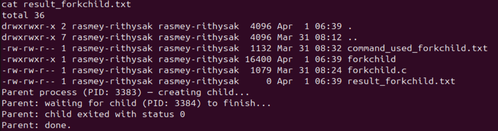
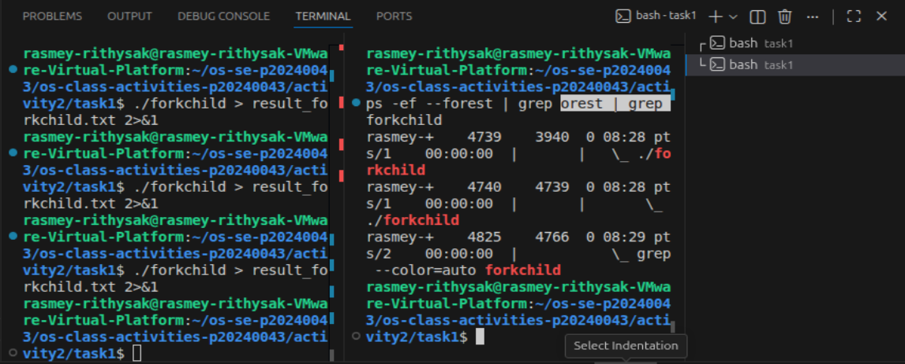
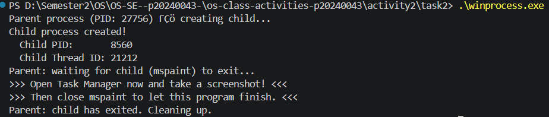
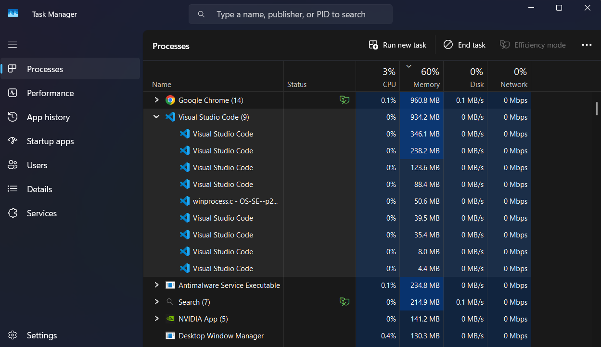
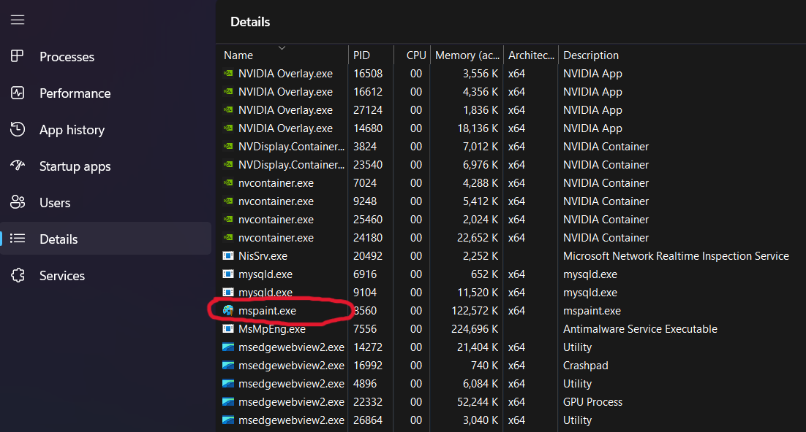
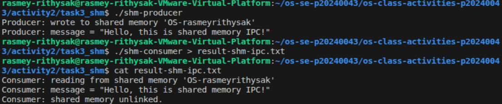
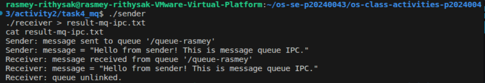

# Class Activity 2 — Processes & Inter-Process Communication

- **Student Name:** Rasmey Rithysak
- **Student ID:** p20240043
- **Date:** April 1, 2026

---

## Task 1: Process Creation on Linux (fork + exec)

### Compilation & Execution

Screenshot of compiling and running `forkchild.c`:



### Process Tree

Screenshot of the parent-child process tree:



### Output
```
Parent process (PID: 4739) — creating child...
Parent: waiting for child (PID: 4740) to finish...
Parent: child exited with status 0
Parent: done.
```

### Questions

1. **What does `fork()` return to the parent? What does it return to the child?**

   > `fork()` returns the child's PID to the parent process, and returns 0 to the child process. If fork fails, it returns -1.

2. **What happens if you remove the `waitpid()` call? Why might the output look different?**

   > Without `waitpid()`, the parent process does not wait for the child to finish. The parent may exit before the child completes, causing the child to become a zombie process. The output order may also be unpredictable.

3. **What does `execlp()` do? Why don't we see "execlp failed" when it succeeds?**

   > `execlp()` replaces the current process image with a new program — in this case `ls -la`. When it succeeds, the process is completely replaced so the lines after `execlp()` never execute. We only see "execlp failed" if the call fails.

4. **Draw the process tree for your program (parent → child). Include PIDs from your output.**

   > ```
   > forkchild (PID: 4739)
   > └── forkchild (PID: 4740)
   >         └── ls -la
   > ```

5. **Which command did you use to view the process tree? What information does each column show?**

   > I used `ps -ef --forest`. The columns show: UID (user), PID (process ID), PPID (parent process ID), CPU usage, start time, terminal, time, and the command name. The `--forest` flag shows the parent-child hierarchy visually with indentation.

---

## Task 2: Process Creation on Windows

### Compilation & Execution

Screenshot of compiling and running `winprocess.c`:



### Task Manager Screenshots

Screenshot showing process tree in the **Processes** tab:



Screenshot showing PID and Parent PID in the **Details** tab:



### Questions

1. **What is the key difference between how Linux creates a process (`fork` + `exec`) and how Windows does it (`CreateProcess`)?**

   > On Linux, process creation is a two-step process — `fork()` creates a copy of the parent, then `exec()` replaces it with a new program. On Windows, `CreateProcess()` does both in a single step — it creates a new process and loads the specified program immediately without copying the parent first.

2. **What does `WaitForSingleObject()` do? What is its Linux equivalent?**

   > `WaitForSingleObject()` blocks the parent process until the child process finishes. Its Linux equivalent is `waitpid()`.

3. **Why do we need to call `CloseHandle()` at the end? What happens if we don't?**

   > `CloseHandle()` releases the process and thread handles held by the parent. If we don't call it, those handles remain open and cause a resource leak — the OS keeps the process object in memory even after the child has exited.

4. **In Task Manager, what was the PID of your parent program and the PID of mspaint? Do they match your program's output?**

   > The parent process (winprocess.exe) had PID 27756 and mspaint had PID 8560. Yes, these match exactly what the program printed in the terminal.

5. **Compare the Processes tab and the Details tab. Which view makes it easier to understand the parent-child relationship? Why?**

   > The Processes tab tree view makes it easier to understand the parent-child relationship because it visually shows the hierarchy with indentation. The Details tab shows raw PID and Parent PID numbers which require manual matching to understand the relationship.

---

## Task 3: Shared Memory IPC

### Compilation & Execution

Screenshot of compiling and running `shm-producer` and `shm-consumer`:



### Output
```
Consumer: reading from shared memory 'OS-rasmeyrithysak'
Consumer: message = "Hello, this is shared memory IPC!"
Consumer: shared memory unlinked.
```

### Questions

1. **What does `shm_open()` do? How is it different from `open()`?**

   > `shm_open()` creates or opens a POSIX shared memory object that can be mapped into multiple processes' address spaces. Unlike `open()` which works with regular files on disk, `shm_open()` works with memory objects stored in RAM, making it much faster for inter-process communication.

2. **What does `mmap()` do? Why is shared memory faster than other IPC methods?**

   > `mmap()` maps the shared memory object into the process's virtual address space, so the process can access it like a regular pointer. Shared memory is the fastest IPC method because data is written and read directly in memory — there is no copying between kernel and user space like in pipes or message queues.

3. **Why must the shared memory name match between producer and consumer?**

   > The name is used by the OS to identify the shared memory object. If the names don't match, the consumer opens a different (or nonexistent) memory object and cannot read the data the producer wrote.

4. **What does `shm_unlink()` do? What would happen if the consumer didn't call it?**

   > `shm_unlink()` removes the shared memory object from the system. If the consumer doesn't call it, the shared memory object remains in the system even after both processes exit, wasting memory until the system reboots or it is manually removed.

5. **If the consumer runs before the producer, what happens? Try it and describe the error.**

   > Running the consumer before the producer causes `shm_open()` to fail with the error: `shm_open: No such file or directory`. This is because the shared memory object hasn't been created yet by the producer.

---

## Task 4: Message Queue IPC

### Compilation & Execution

Screenshot of compiling and running `sender` and `receiver`:



### Output
```
Receiver: message received from queue '/queue-rasmey'
Receiver: message = "Hello from sender! This is message queue IPC."
Receiver: queue unlinked.
```

### Questions

1. **How is a message queue different from shared memory? When would you use one over the other?**

   > Shared memory allows direct memory access between processes and is faster, but requires manual synchronization. Message queues are slower but handle synchronization automatically — messages are sent and received as discrete units in FIFO order. Use shared memory for large, frequent data transfers. Use message queues when you need structured, ordered messaging between processes.

2. **Why does the queue name in `common.h` need to start with `/`?**

   > POSIX message queue names must start with `/` because the OS uses it as a namespace to identify and locate the queue in the system. Without the `/`, `mq_open()` will return an error.

3. **What does `mq_unlink()` do? What happens if neither the sender nor receiver calls it?**

   > `mq_unlink()` removes the message queue from the system. If neither process calls it, the queue persists in the system after both processes exit, consuming kernel resources until the system reboots or it is manually removed.

4. **What happens if you run the receiver before the sender?**

   > The receiver's `mq_open()` will fail with an error because the queue doesn't exist yet. It will print `mq_open: No such file or directory` and exit.

5. **Can multiple senders send to the same queue? Can multiple receivers read from the same queue?**

   > Yes, multiple senders can send to the same queue — messages will be queued in order. Multiple receivers can also read from the same queue, but each message can only be received by one receiver — once a message is read it is removed from the queue.

---

## Reflection

> This activity gave me hands-on experience with how operating systems manage processes and enable communication between them. The most interesting difference between Linux and Windows process creation is that Linux uses two separate steps — `fork()` to copy the process and `exec()` to replace it — while Windows combines everything into a single `CreateProcess()` call. I prefer shared memory as an IPC method because it is the fastest and most direct way for processes to share data, even though it requires careful management of the shared memory object lifecycle.