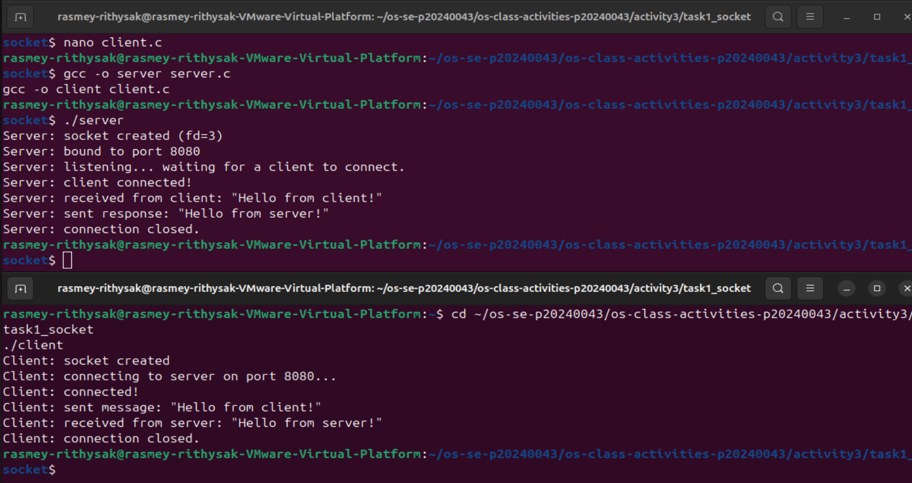
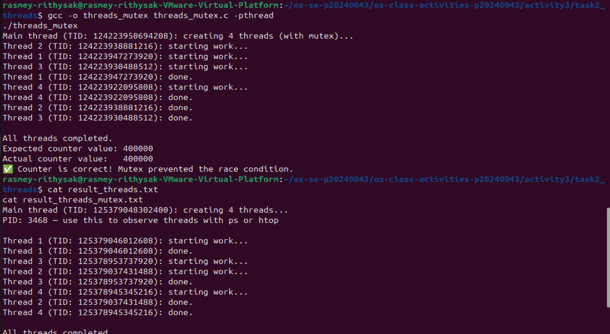
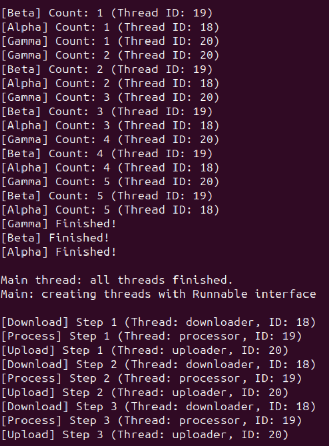

# Class Activity 3 — Socket Communication & Multithreading

- **Student Name:** Rasmey Rithysak
- **Student ID:** p20240043
- **Date:** April 5, 2025

---

## Task 1: TCP Socket Communication (C)

### Compilation & Execution

### Answers

1. **Role of `bind()` / Why client doesn't call it:**
   > `bind()` attaches the server socket to a specific IP address and port number so clients know where to connect. The client doesn't call `bind()` because it doesn't need a fixed port — the OS automatically assigns it a temporary port when it calls `connect()`.

2. **What `accept()` returns:**
   > `accept()` returns a new socket file descriptor specifically for communicating with the connected client. It is different from the original server socket — the server socket keeps listening for new connections, while the new socket returned by `accept()` is used only for that one client.

3. **Starting client before server:**
   > If you start the client before the server, the client fails immediately with a "Connection refused" error because there is no server listening on port 8080 yet.

4. **What `htons()` does:**
   > `htons()` converts a port number from host byte order to network byte order (big-endian). Different CPUs store bytes in different orders, so this conversion ensures both server and client agree on the port number regardless of the hardware.

5. **Socket call sequence diagram:**
   > Server: socket() → bind() → listen() → accept() → read() → send() → close()
   > Client: socket() → connect() → send() → read() → close()

---

## Task 2: POSIX Threads (C)

### Output — Without Mutex (Race Condition)

### Output — With Mutex (Correct)

_(included in same screenshot)_

### Answers

1. **What is a race condition?**
   > A race condition occurs when multiple threads access and modify shared data at the same time without synchronization. In `threads.c`, all 4 threads increment `shared_counter` simultaneously, so some increments get lost because one thread overwrites another's result before it is saved. That's why the final counter is less than 400000.

2. **What does `pthread_mutex_lock()` do?**
   > `pthread_mutex_lock()` blocks a thread from entering a critical section if another thread is already inside it. Only one thread can hold the lock at a time, so the counter increment becomes atomic — no two threads can modify `shared_counter` at the same time, fixing the race condition.

3. **Removing `pthread_join()`:**
   > If you remove `pthread_join()`, the main thread finishes and exits before the worker threads are done. This causes the program to terminate early, and the worker threads are killed before they complete their work. The output will be incomplete or missing.

4. **Thread vs Process:**
   > A thread is a lightweight unit of execution inside a process. Threads share the same memory space (code, heap, global variables, open files) but each has its own stack and registers. A process has its own separate memory space. Threads are faster to create and communicate easily through shared memory, but need synchronization to avoid race conditions.

---

## Task 3: Java Multithreading

### Output

### Answers

1. **Thread vs Runnable:**
   > Extending `Thread` means your class cannot extend any other class (Java has single inheritance). Implementing `Runnable` is more flexible because your class can still extend another class. `Runnable` is preferred when you want to separate the task logic from the thread itself, or when using thread pools like `ExecutorService`.

2. **Pool size limiting concurrency:**
   > The pool is created with only 2 threads using `Executors.newFixedThreadPool(2)`. Even though 6 tasks are submitted, only 2 threads exist in the pool. The remaining 4 tasks wait in a queue until one of the 2 threads finishes and becomes available.

3. **thread.join() in Java:**
   > `thread.join()` makes the main thread wait until the specified thread finishes. If you remove it from `ThreadDemo`, the main thread will print "all threads finished" before Alpha, Beta, and Gamma actually complete, and the output will be out of order or incomplete.

4. **ExecutorService advantages:**
   > `ExecutorService` manages a pool of reusable threads instead of creating a new thread for every task. Creating threads is expensive — with a pool, threads are reused, saving time and memory. It also provides better control over concurrency (fixed pool size), task queuing, and graceful shutdown, making it much better for large applications.

---

## Task 4: Observing Threads

### Linux — `ps -eLf` Output

rasmey-+    3585    3394    3585  0    5 18:12 pts/0    00:00:00 ./threads_observe
rasmey-+    3585    3394    3586  0    5 18:12 pts/0    00:00:00 ./threads_observe
rasmey-+    3585    3394    3587  0    5 18:12 pts/0    00:00:00 ./threads_observe
rasmey-+    3585    3394    3588  0    5 18:12 pts/0    00:00:00 ./threads_observe
rasmey-+    3585    3394    3589  0    5 18:12 pts/0    00:00:00 ./threads_observe
rasmey-+    3597    3394    3597  0    1 18:13 pts/0    00:00:00 grep --color=auto threads_observe
    PID    SPID TTY          TIME CMD
   3585    3585 pts/0    00:00:00 threads_observe
   3585    3586 pts/0    00:00:00 threads_observe
   3585    3587 pts/0    00:00:00 threads_observe
   3585    3588 pts/0    00:00:00 threads_observe
   3585    3589 pts/0    00:00:00 threads_observe
--- /proc/3585/task/ listing ---
3585
3586
3587
3588
3589

### Linux — htop Thread View

### Answers

1. **LWP column meaning:**
   > LWP stands for Light Weight Process — it is the thread ID assigned by the Linux kernel to each thread. All threads in the same process share the same PID but each has a unique LWP. This is how the kernel identifies and schedules individual threads.

2. **/proc/PID/task/ count:**
   > There were 5 entries in `/proc/3585/task/` — one for the main thread and one for each of the 4 worker threads. This matches exactly the number of threads created in the program (NUM_THREADS=4 plus the main thread).

3. **Extra Java threads:**
   > The JVM automatically creates several internal threads when a Java program runs, such as the garbage collector thread, JIT compiler thread, signal dispatcher, and others. So even though we only created 3 threads in `ThreadDemo`, Task Manager shows more because of these JVM background threads.

4. **Linux vs Windows thread viewing:**
   > Linux provides more detailed thread information through tools like `ps -eLf`, `ps -T`, `/proc/<PID>/task/`, and `htop`. You can see individual thread IDs (LWP), states, and CPU usage per thread. Windows Task Manager only shows the total thread count for a process without individual thread details, making Linux more useful for low-level thread debugging.

---

## Reflection
> The most interesting part was seeing the race condition in action — the counter gave a different wrong answer every run, which clearly showed how unpredictable concurrent programs can be without synchronization. Understanding threads at the OS level through `ps`, `/proc`, and `htop` helped connect the code to what the kernel actually does. This knowledge is essential for writing correct concurrent programs because it shows that the OS can schedule threads in any order, so shared data must always be protected with mutexes or other synchronization mechanisms.
