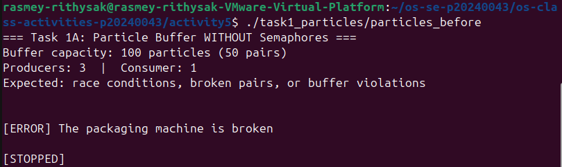
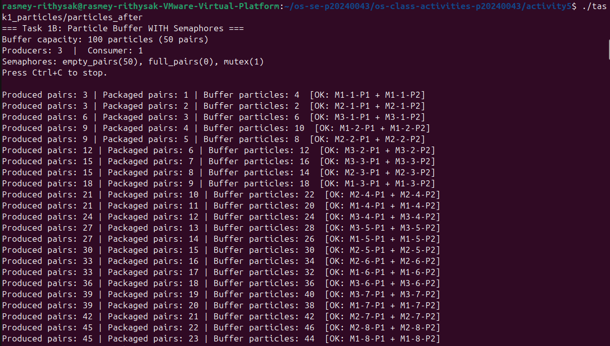
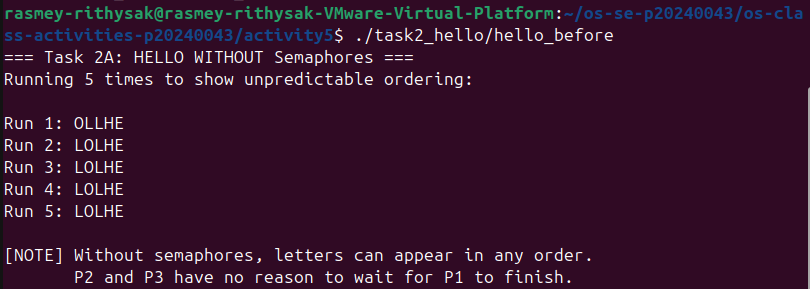
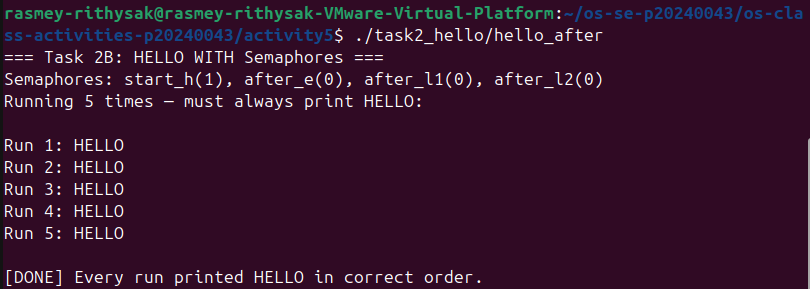

# Class Activity 5 - Semaphores

- **Student Name:** Rasmey Rithysak
- **Student ID:** p20240043
- **Programming Language Used:** C++20

---

## Task 1A: Particle Pair Buffer Before Semaphores

- What error or incorrect behavior appeared: `[ERROR] The packaging machine is broken` — the consumer ran immediately before any producer finished writing, so the buffer was empty.
- Why did this happen without semaphore protection: There is nothing blocking the consumer from running before producers write data. Multiple producers also write to the buffer at the same time with no mutex, causing race conditions on shared variables like `count`, `head`, and `tail`.

---

## Task 1B: Particle Pair Buffer After Semaphores

- Number of producer machines: 3
- Buffer capacity: 100 particles (50 pairs)
- Semaphores used: `empty_pairs(50)`, `full_pairs(0)`, `mutex(1)`
- Produced pair count shown in screenshot: (check your screenshot)
- Packaged pair count shown in screenshot: (check your screenshot)
- Did any error appear during normal operation? No

---

## Task 2A: HELLO Before Semaphores

- Output before semaphore ordering: `LOHLE`, `LOLHE` (unpredictable every run)
- Why this output can be wrong or unpredictable: All three threads start at the same time with no ordering. The OS scheduler decides which thread runs first, so L and O can print before H and E.

---

## Task 2B: HELLO After Semaphores

- Processes or threads used: 3 threads — process1 (H, E), process2 (L, L), process3 (O)
- Semaphores used: `start_h(1)`, `after_e(0)`, `after_l1(0)`, `after_l2(0)`
- Final output: HELLO (correct every run)

---

## Questions

1. A producer must wait because the buffer has a fixed capacity of 100 particles. Without waiting, it can overflow the buffer and overwrite data the consumer has not read yet. The `empty_pairs` semaphore blocks the producer when no pair-slots are free.

2. The consumer must wait because it can only fetch particles when a complete pair is already in the buffer. Without waiting, it reads from an empty or partially-written slot, getting garbage data or crashing. The `full_pairs` semaphore blocks the consumer until a complete pair exists.

3. The `mutex` semaphore (initialized to 1) protects the critical section. Every read and write to `buffer[]`, `head`, `tail`, and the counters happens inside `sem_wait(&mutex)` and `sem_post(&mutex)`.

4. Each particle ID has the format `M<machine>-<pair_id>-P1` or `M<machine>-<pair_id>-P2`. The consumer strips the last `-P1` or `-P2` using `rfind('-')` and compares the base strings. If `M2-17 == M2-17` the pair is valid. If they differ, it prints `[ERROR] Pairs are incorrect`.

5. All three threads start simultaneously with no ordering constraint. Thread 2 and Thread 3 have no instruction telling them to wait for Thread 1. The OS scheduler decides execution order, so L, L, or O can print before H or E.

6. `start_h` is initialized to 1, so Process 1 starts immediately. Process 2 is blocked on `after_e` which starts at 0. Process 1 prints H and E first, then calls `sem_post(&after_e)` to unblock Process 2. H and E are always printed before anything else.

7. In Task 1, deadlock would happen if a producer holds `mutex` and then waits on `empty_pairs` while the buffer is full, but the consumer cannot call `sem_post(&empty_pairs)` because it is blocked waiting for `mutex` — both wait on each other forever. In Task 2, deadlock would happen if any semaphore in the chain is never signaled, for example if `sem_post(&after_l1)` were removed, Process 2 would block forever and Process 3 would never receive `sem_post(&after_l2)`.

---

## Reflection

Before this activity, semaphores felt abstract. After writing these four programs it became clear why both counting and mutex roles matter. Task 1 showed that you need two semaphore types working together — counting semaphores to enforce capacity limits and a binary mutex to protect shared memory. Getting the order of sem_wait calls wrong causes deadlock, and forgetting a sem_post causes starvation. Task 2 showed that semaphores are not only for protecting shared memory — they can also sequence unrelated threads into a deterministic order using a signal chain, which is useful any time you need to coordinate steps across independent workers.
