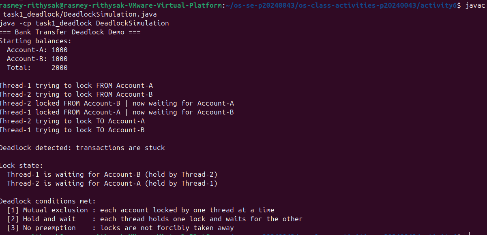
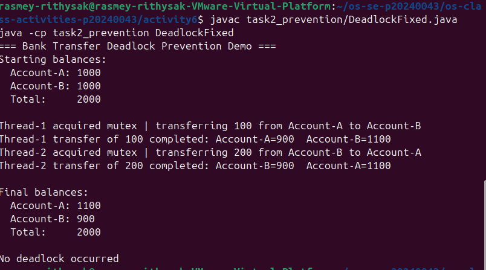

# Class Activity 6 - Deadlock Simulation

- **Student Name:** Rasmey Rithysak
- **Student ID:** p20240043
- **Programming Language Used:** Java

---

## Task 1: Deadlock Version

- Shared resources: Account-A and Account-B
- Transaction 1: Transfer 100 from Account-A to Account-B
- Transaction 2: Transfer 200 from Account-B to Account-A
- Deadlock message shown: `Deadlock detected: transactions are stuck`
- Explanation of why the program got stuck: Thread-1 locked Account-A and waited for Account-B. At the same time, Thread-2 locked Account-B and waited for Account-A. Neither thread could proceed because each was holding the lock the other needed, creating a circular wait.

---

## Task 2: Deadlock Prevention Version

- Prevention strategy used: Single shared semaphore mutex initialized to 1
- Semaphore mutex initial value: 1
- Starting total: 2000
- Final total: 2000
- Did both transfers complete? Yes
- Why no deadlock occurred: Only one thread can acquire the mutex at a time. While one thread holds the mutex and performs its transfer, the other thread waits. There is no circular wait because threads never hold one account lock while waiting for another.

---

## Questions

1. **What are the two shared resources in your bank transaction simulation?**
   Account-A and Account-B. Both threads need access to both accounts to complete a transfer.

2. **Which line or section of your Task 1 program creates hold-and-wait?**
   After `from.lock.acquire()`, the thread sleeps and then calls `to.lock.acquire()`. At this point the thread is holding the source account lock while waiting for the destination account lock.

3. **How does Task 1 create circular wait?**
   Thread-1 holds Account-A and waits for Account-B. Thread-2 holds Account-B and waits for Account-A. Each thread is waiting for a resource held by the other, forming a cycle: Thread-1 → Account-B → Thread-2 → Account-A → Thread-1.

4. **Why does the Task 1 program need a watchdog or timeout?**
   Without a watchdog, the program would hang forever silently. The watchdog detects that no transfer completed after 3 seconds and prints the deadlock message so the output clearly shows deadlock occurred.

5. **How does the single semaphore mutex prevent deadlock in Task 2?**
   The mutex allows only one thread to enter the transfer critical section at a time. The other thread must wait until the mutex is released. Since only one thread runs the transfer at a time, there is no possibility of two threads each holding one lock and waiting for the other.

6. **Which of the four deadlock conditions does your Task 2 solution remove or avoid?**
   It removes circular wait and hold-and-wait. Only one thread holds the mutex at a time and completes the full transfer before releasing it, so no thread ever holds a partial lock while waiting for another.

7. **Why must the final total bank balance remain unchanged after both transfers?**
   Money is only moved between accounts, not created or destroyed. Transfer 1 moves 100 from A to B, and Transfer 2 moves 200 from B to A. The net effect changes individual balances but the total must always remain 2000 to ensure correctness and no data corruption.

---

## Reflection

This activity showed me that deadlock is not just a theoretical problem. In real banking or database systems, two transactions locking resources in opposite orders can silently freeze the entire system. The single mutex solution is simple and effective, but it forces transfers to run one at a time. In real systems, a better approach like consistent lock ordering allows more concurrency while still preventing deadlock. This made me appreciate why database systems use sophisticated locking protocols and deadlock detection algorithms.
