# Class Activity 7 - Reasoning About Deadlock

- **Student Name:** Rasmey Rithysak
- **Student ID:** p20240043
- **My personalization:** a = 1 (last digit), b = 4 (second-to-last digit)
  - Max[P0][A] = 7 + (1 mod 3) = **8**
  - Max[P2][C] = 2 + (4 mod 4) = **2**

---

## Task 1 — Resource Allocation Graphs

### Part A

**Graph 1 — my prediction:** There is a cycle. Every process holds one resource and waits for the next in a circle, so the system is deadlocked. Cycle: `P0 → R1 → P1 → R2 → P2 → R0 → P0`

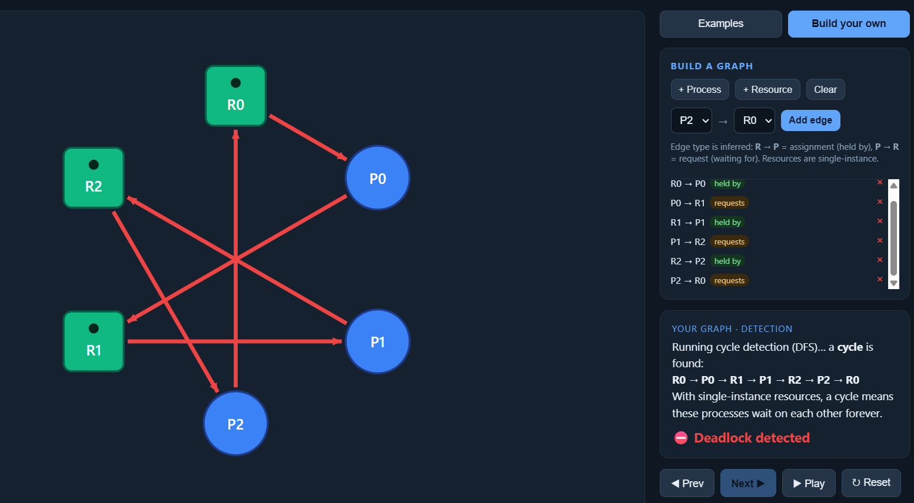

Matched the tool? **Yes** — deadlock detected with the same cycle path.

---

**Graph 2 — my prediction:** No cycle. P2 holds R2 but requests nothing, so P2 finishes first and releases R2. Then P1 unblocks, then P0. No deadlock.

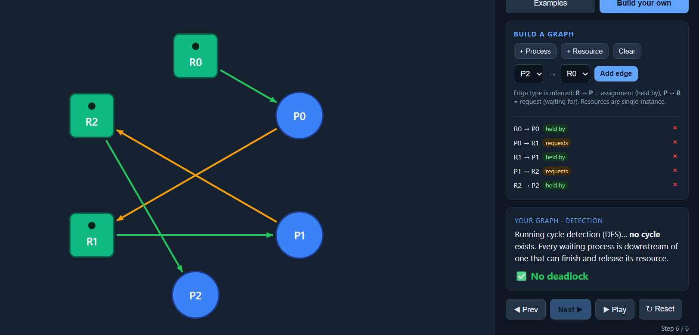

Matched the tool? **Yes** — no cycle, no deadlock.

---

### Part B

**(i) Deadlocked 3×3 graph** — edges used: R0→P0, P0→R1, R1→P1, P1→R2, R2→P2, P2→R0. Each process holds one resource and waits for the next in a circle, so no process can ever release what it holds.

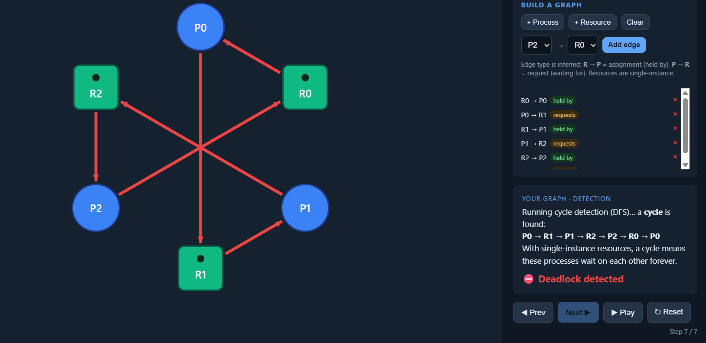

---

**(ii) No-cycle graph (≥4 nodes, ≥1 request)** — edges used: R0→P0, R1→P1, P0→R1. P1 holds R1 and requests nothing, so it finishes and releases R1 to unblock P0 — no circular wait exists.

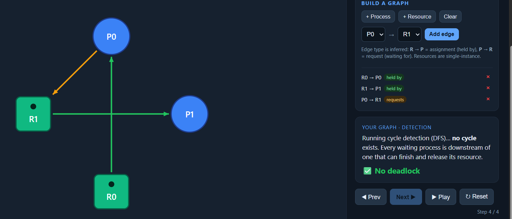

---

## Task 2 — Cycle ≠ Deadlock

### Warm-up

1. **Cycle, NO deadlock:** Despite the cycle, P3 has no requests, so it finishes immediately using the spare instance of R2. It releases its allocation, which breaks the cycle and lets the other processes proceed.

2. **Single change that causes deadlock:** The spare instance of R2 is removed (total instances reduced from 2 to 1). With no free instance available, no process can start the reduction and everyone is stuck.

---

### Part A — Given scenario

**Available = Total − ΣAlloc:**
- R1: 2 − (1+0+1) = 0
- R2: 1 − (0+1+0) = 0
- R3: 2 − (0+1+1) = 0
- Available = [0, 0, 0]

**Cycle:** `P1 → R2 → P2 → R1 → P1`. P3 is in the cycle area but requests nothing [0,0,0], so it can finish first.

**Reduction by hand:**

| Step | Process | Why Request ≤ Work | Work after release |
|------|---------|--------------------|--------------------|
| 1 | P3 | Request [0,0,0] ≤ Work [0,0,0] ✓ | [1, 0, 1] |
| 2 | P2 | Request [1,0,0] ≤ Work [1,0,1] ✓ | [1, 1, 2] |
| 3 | P1 | Request [0,1,0] ≤ Work [1,1,2] ✓ | [2, 1, 2] |

**Conclusion: NOT deadlocked. Finishing order: P3 → P2 → P1.**

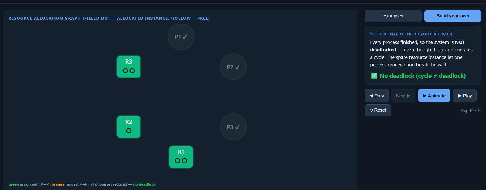

**After changing P3's request to [0,1,0]:** Work starts at [0,0,0]. P3 needs R2=1 but Work R2=0, P1 needs R2=1 but Work R2=0, P2 needs R1=1 but Work R1=0. No process can start the reduction — deadlock.

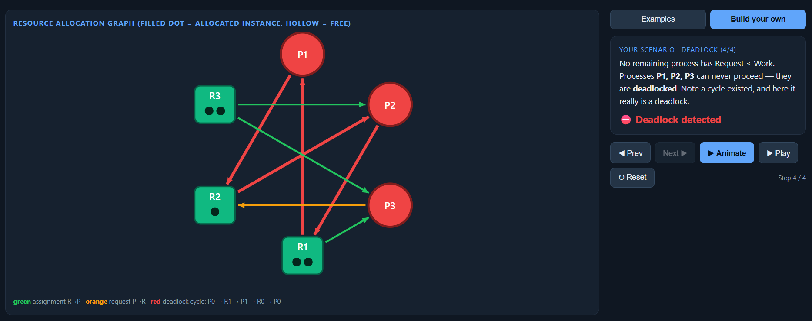

---

### Part B — My own scenario

I built a scenario with R1=2, R2=1 where P1 and P2 both hold R1 and request R2, and P3 holds R2 and requests nothing. A cycle exists but P3 finishes first and releases R2, breaking the cycle.

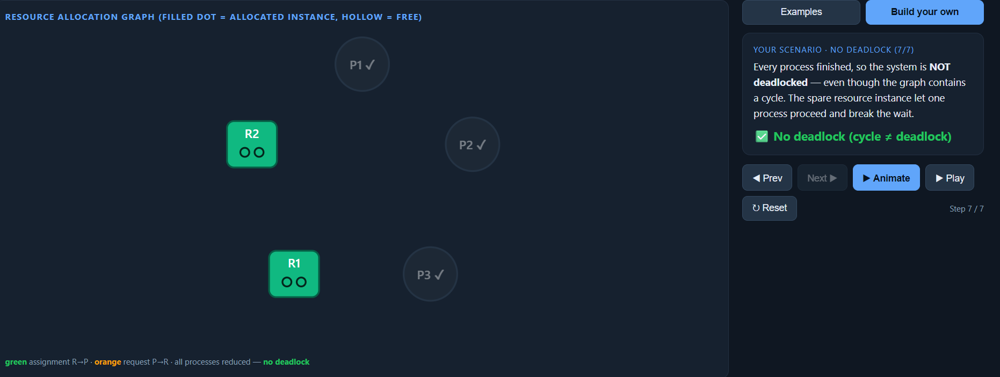

**One change → deadlock:** I reduced R2 instances to 1 and added a request from P3 for R2. Now Available=[0,0], no process can satisfy its request, and the reduction cannot start.

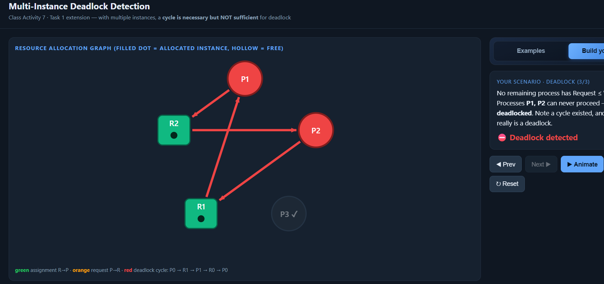

---

## Task 3 — Banker's Algorithm

**My personalized Max matrix:**
```
        Max
        A   B   C
P0      8   5   3
P1      3   2   2
P2      9   0   2
```

**Need = Max − Allocation:**
```
        Need
        A   B   C
P0      8   4   3
P1      1   2   2
P2      6   0   0
```

**Available = Total − ΣAlloc = [10-5, 5-1, 7-2] = [5, 4, 5]**

**Safety trace (by hand):**

| Step | Process | Why Need ≤ Work | Work after release |
|------|---------|------------------|--------------------|
| 1 | P1 | Need [1,2,2] ≤ Work [5,4,5] ✓ | [7, 4, 5] |
| 2 | P2 | Need [6,0,0] ≤ Work [7,4,5] ✓ | [10, 4, 7] |
| 3 | P0 | Need [8,4,3] ≤ Work [10,4,7] ✓ | [10, 5, 7] |

**Conclusion: SAFE — safe sequence = P1 → P2 → P0**


Matched the tool? **Yes** — tool confirmed safe sequence P1 → P2 → P0.

---

**Request I predicted GRANTED:** P1 requests [1, 0, 0]
- Check 1: [1,0,0] ≤ Need[P1] [1,2,2] ✓
- Check 2: [1,0,0] ≤ Available [5,4,5] ✓
- Check 3: Tentative state still safe ✓
- **Granted.**

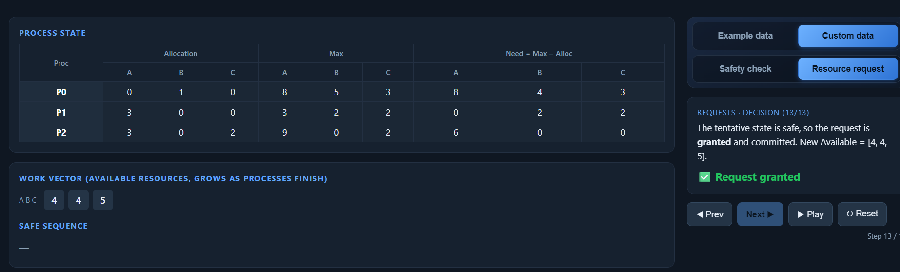

---

**Request I predicted DENIED:** P0 requests [5, 4, 3]
- Check 1: [5,4,3] ≤ Need[P0] [8,4,3] ✓
- Check 2: [5,4,3] ≤ Available [5,4,5] ✓
- Check 3: Tentative Available = [0,0,2]. No process can proceed — unsafe. **Denied.**

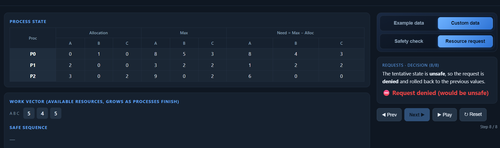

---

## Task 4 — Semaphores and Deadlock

**Case 1 (s1=s2=s3=1) — NO deadlock.**
P1 acquires s1, P2 acquires s2, P3 tries wait(s1) and blocks. P1 tries wait(s2) and blocks. But P2 can acquire s3 freely, finish, and release s2, which unblocks P1. No circular wait forms because P2 never requests s1.

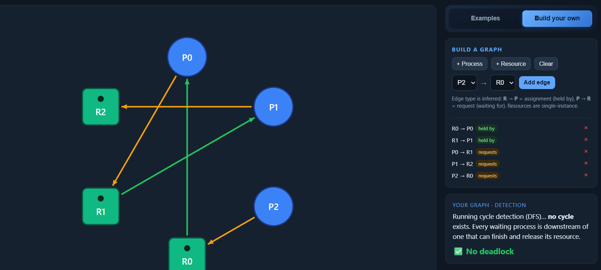

Tool confirmed? **Yes — no cycle detected.**

---

**Case 2 (s1=s2=s3=1) — YES, deadlock.**
Worst-case interleaving: P1 grabs s1, P3 grabs s2, P3 grabs s3, P1 waits s2 (held by P3), P3 waits s1 (held by P1). Cycle: `P1 → s2 → P3 → s1 → P1`. Both are stuck forever.

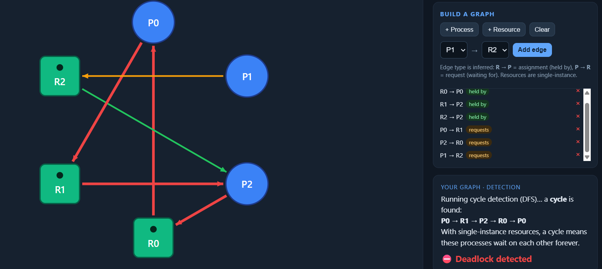

Tool confirmed? **Yes — deadlock detected with cycle P0 → R1 → P2 → R0 → P0.**

---

**Case 3 (s1=2) — NO deadlock.**
Same code as Case 2 but s1 has 2 instances. When P1 holds one instance of s1, the second instance is still free. P3's wait(s1) is satisfied by the spare instance, so P3 finishes and releases s2 and s3, unblocking everyone. The circular wait never forms.

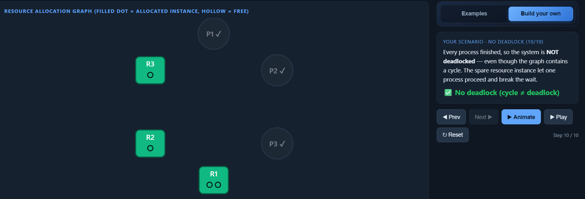

Tool confirmed? **Yes — no deadlock detected.**

---

## Task 5 — Applied Concepts

**1. Four necessary conditions for deadlock:**
Imagine two students in a library sharing a printer and a stapler. Mutual exclusion: only one student can use the printer at a time. Hold and wait: Student A holds the printer and waits for the stapler. No preemption: nobody can forcibly take the stapler from Student B. Circular wait: Student A waits for Student B's stapler, and Student B waits for Student A's printer. The easiest condition to remove is hold and wait — require each student to request both devices at once before starting. The cost is wasted idle time waiting for both even when only one is needed.

**2. Single-instance vs multi-instance cycles:**
In a single-instance system, a cycle means every process in the cycle is waiting for a resource that can only be freed by another process in the same cycle — so it is definitely deadlock. In a multi-instance system, a spare instance of a resource in the cycle may still be available, letting one process finish and break the cycle without everyone being stuck.

**3. Unsafe vs deadlocked:**
A deadlocked state means processes are already stuck and cannot proceed at all. An unsafe state means the OS cannot guarantee all processes will finish — deadlock might happen in the future but has not happened yet. Example: Available=[1,0] with one process needing [1,0] to finish — not deadlocked yet, but the OS cannot prove everyone else will complete.

**4. Avoidance vs detection + recovery:**
Banker's avoidance checks every request before granting it and refuses anything leading to an unsafe state. Its cost is that every process must declare its maximum resource need in advance, which is often impractical. Good for: real-time systems where deadlock must never occur. Detection + recovery lets deadlocks happen, finds them periodically, then breaks them by killing a process. Its cost is wasted work when recovery is triggered. Good for: databases, which can roll back transactions cleanly.

**5. Why Banker's needs maximum demand declared upfront:**
Without knowing the maximum, the algorithm cannot determine whether a future state will be safe. In practice this is hard because most processes do not know in advance how many resources they will need — a web server cannot predict how many connections it will handle. This makes Banker's Algorithm largely impractical for general-purpose operating systems.

---

## Reflection

This activity showed that reasoning about deadlock is more subtle than it first appears. The most important insight is that a cycle in a multi-instance system does not always mean deadlock — a single spare instance can let one process finish and break the entire wait chain. The Banker's Algorithm made this concrete: by tracking the Work vector step by step, it becomes clear why the OS refuses requests that would leave no safe path forward, even when resources are technically available right now. The trade-off between avoidance and detection is also clearer after this activity — avoidance is safer but requires information processes rarely have, while detection is more practical but risks wasted work when recovery is needed.
