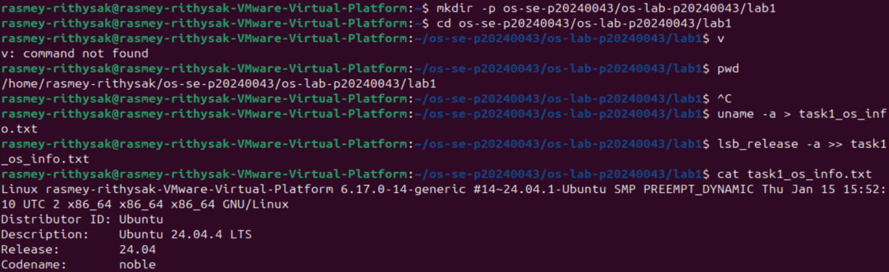
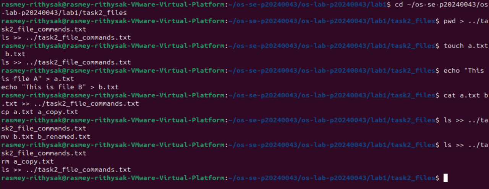
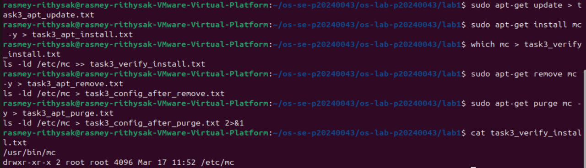
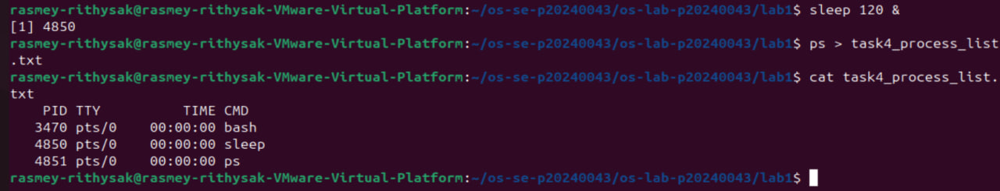
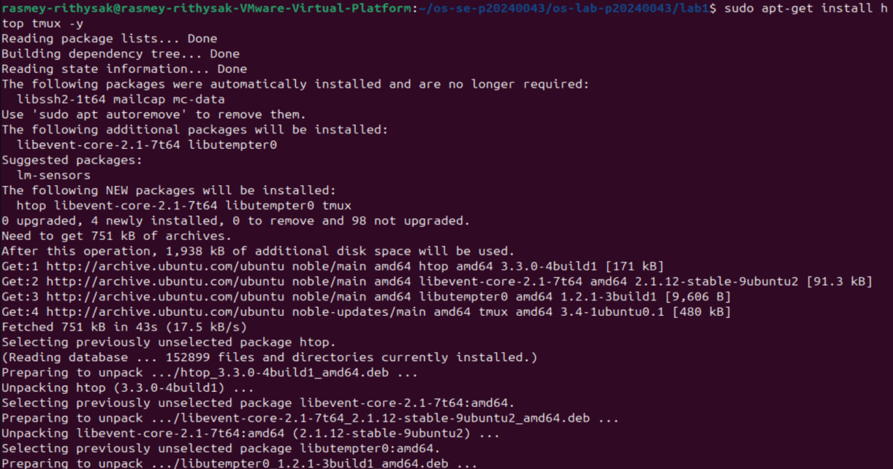
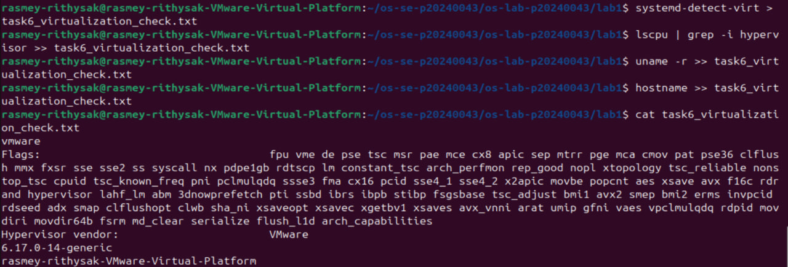

# OS Lab 1 Submission

- **Student Name:** Rasmey Rithysak
- **Student ID:** p20240043

---

## Task 1: Operating System Identification
Ubuntu 24.04.4 LTS, kernel 6.17.0-14-generic, x86_64 architecture.

---

## Task 2: Essential Linux File and Directory Commands
Practiced `mkdir`, `touch`, `echo`, `cp`, `mv`, and `rm`. Results saved to task2_file_commands.txt.

---

## Task 3: Package Management Using APT
`remove` uninstalls the package but keeps config files (`/etc/mc` remained). `purge` removes everything including configs (`/etc/mc` was gone).

---

## Task 4: Programs vs Processes (Single Process)
Ran `sleep 120 &` — it was assigned a PID and appeared in `ps` output while the shell remained usable.

---

## Task 5: Installing Real Applications & Observing Multitasking
Ran two sleep processes and a Python HTTP server simultaneously. All appeared in `ps`, confirming the OS handles multiple processes at once.

---

## Task 6: Virtualization and Hypervisor Detection
`systemd-detect-virt` returned `vmware`. `lscpu` confirmed `Hypervisor vendor: VMware`, meaning the system runs inside a VM.

