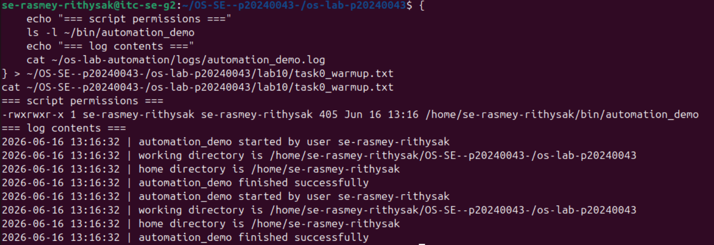
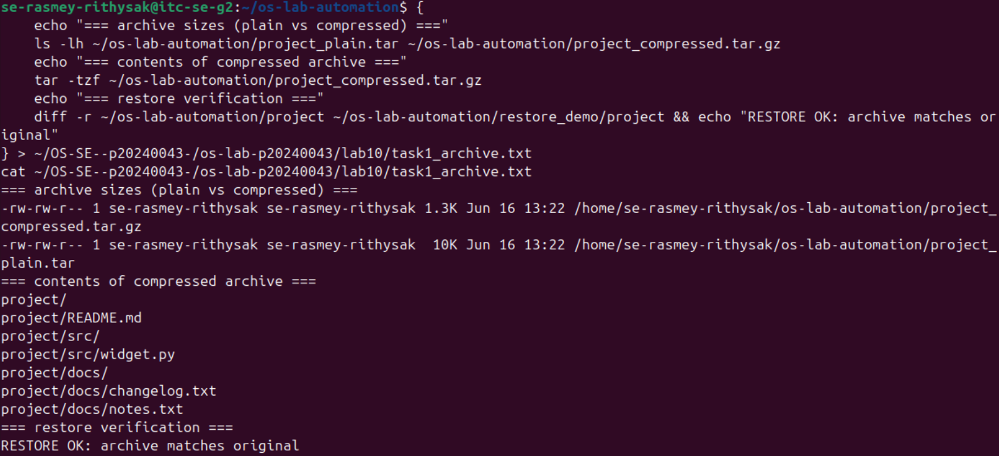
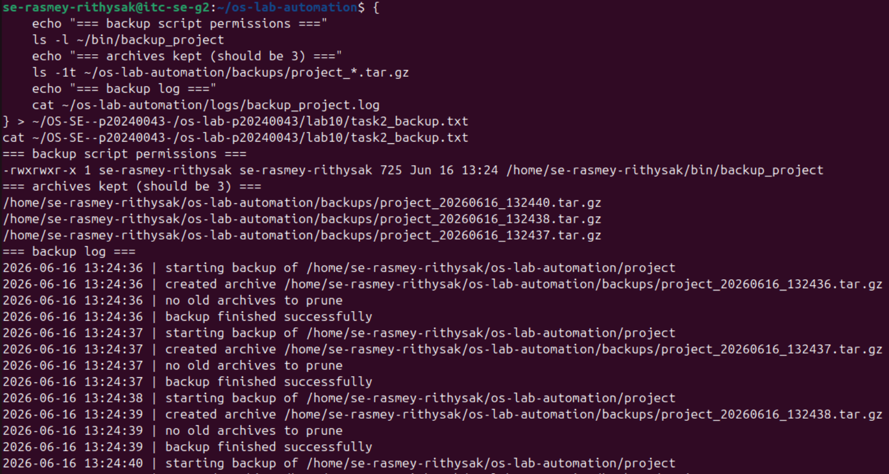
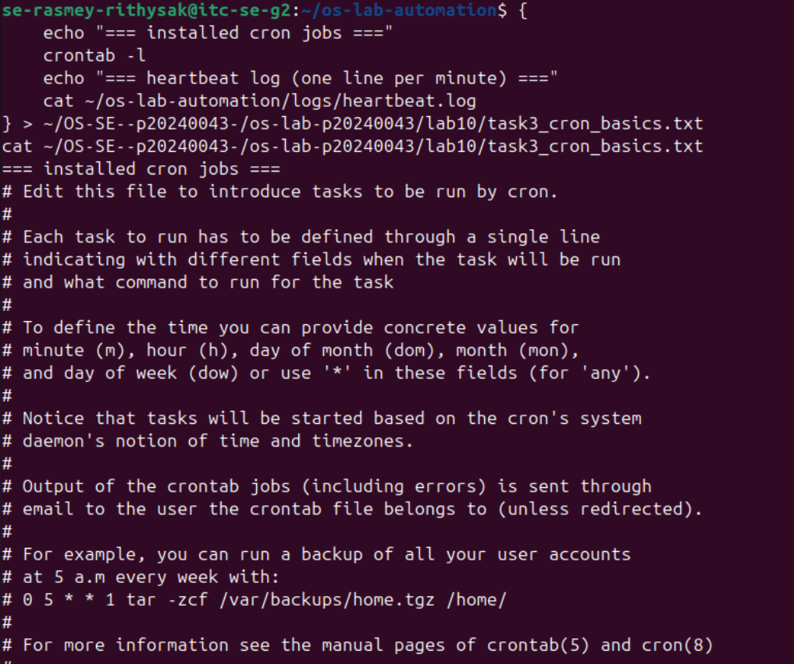
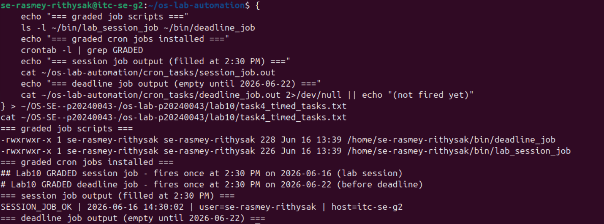
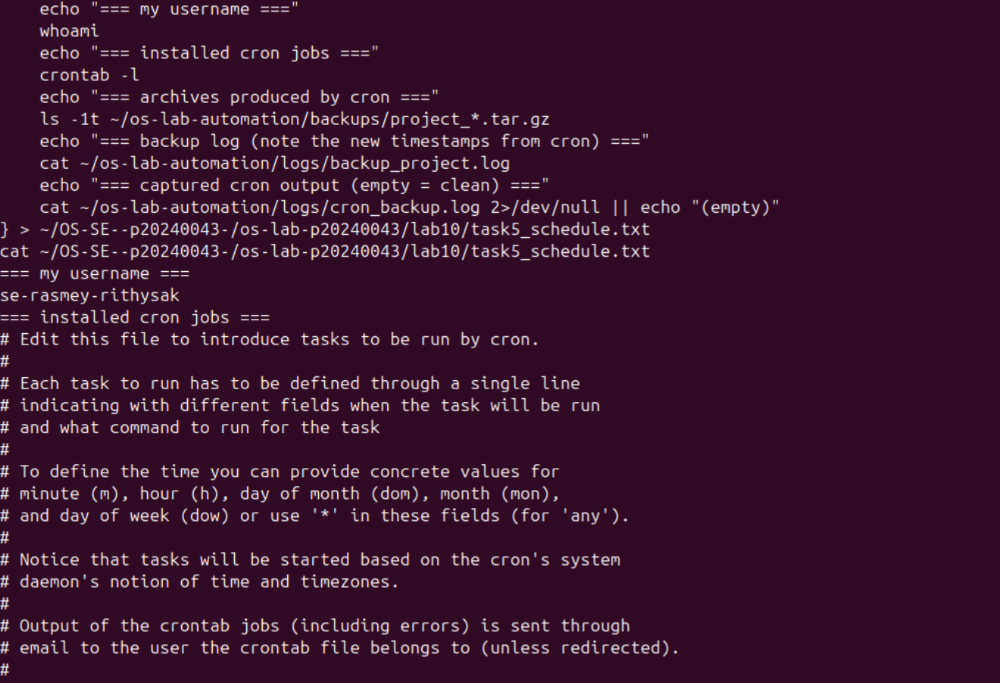
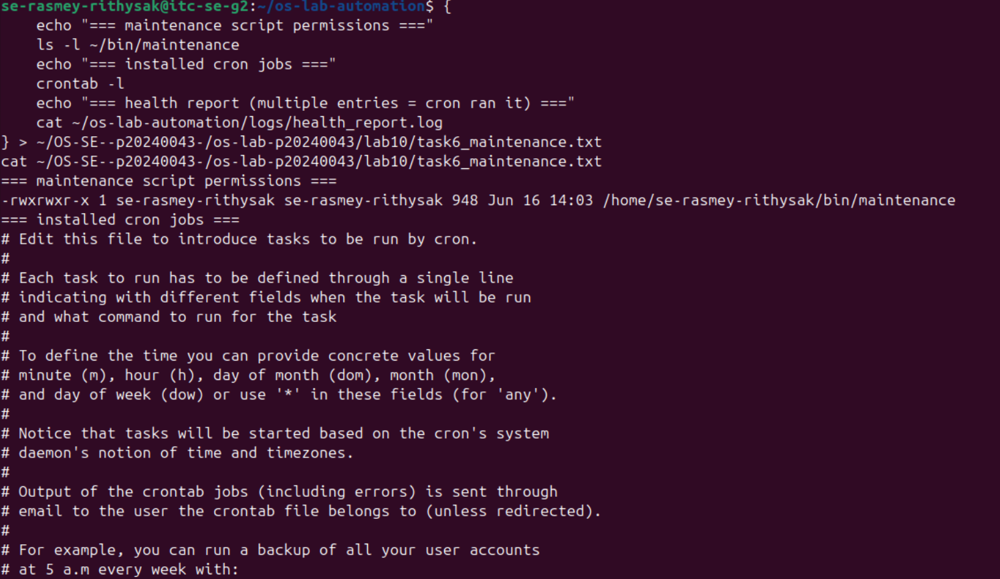
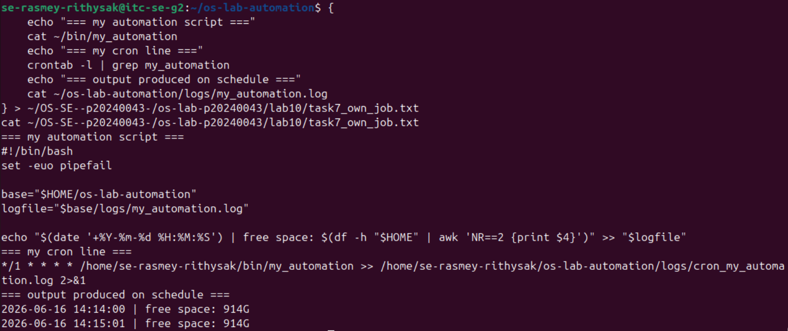
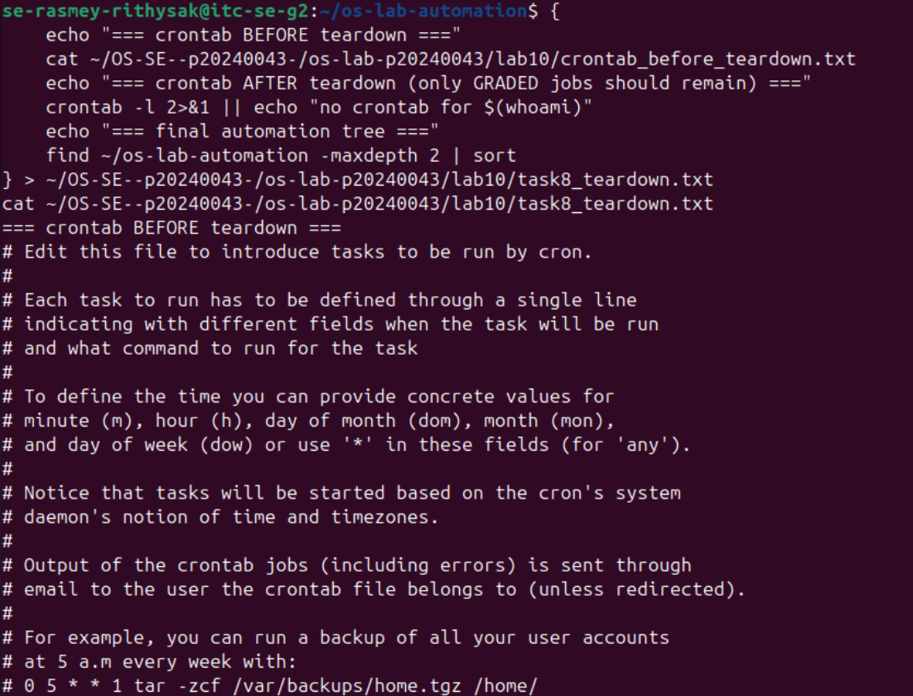

# OS Lab 10 - Backups, Archiving, Scheduling & cron Automation

| | |
|---|---|
| **Student Name** | Rasmey Rithysak |
| **Student ID** | p20240043 |
| **Linux Username** | se-rasmey-rithysak |
| **Date** | 2026-06-16 |

---

## Level 0 - Automation Warm-Up

**What I did:**
I created a script called `automation_demo` that uses a `log()` function to write timestamped messages to a log file. I ran it twice to confirm it appends to the log without overwriting it, then verified the exit status was `0`.

---

## Level 1 - Archiving & Compression

**Size of .tar vs .tar.gz and why:**
The `.tar` file was much larger than the `.tar.gz` because `tar` alone only bundles files together without shrinking them, while `gzip` compresses the bytes. Since the project files were mostly plain text, they compressed very efficiently.

---

## Level 2 - File & Folder Backup Script

**How my retention keeps only the 3 newest archives:**
After creating a new archive, the script runs `ls -1t` to list all archives sorted newest-first, then uses `tail -n +4` to get everything after the 3rd entry. Those older files are deleted with `rm -f`.

---

## Level 3 - Cron Fundamentals

**My heartbeat cron line and what each field means:**

| Field | Value | Meaning |
|-------|-------|---------|
| minute | `*` | every minute |
| hour | `*` | every hour |
| day of month | `*` | every day |
| month | `*` | every month |
| day of week | `*` | every day of the week |

---

## Level 4 - Timed Graded Cron Tasks

| Job | Schedule | Fires at |
|-----|----------|----------|
| Session job | `30 14 16 6 *` | 2:30 PM 2026-06-16 |
| Deadline job | `30 14 22 6 *` | 2:30 PM 2026-06-22 |

**Session job fired during the lab:**

**Deadline job fired before the deadline:**

---

## Level 5 - Scheduling the Backup

**Why the job needed the absolute path and output redirect:**
Cron runs with a minimal environment and does not load your shell PATH, so it cannot find scripts in ~/bin by name. Using the full absolute path guarantees cron can locate the script. The >> logfile 2>&1 captures both stdout and stderr into a log file.

---

## Level 6 - Maintenance Automation

**What my maintenance job rotates and reports:**
The script moves any .log files older than 1 day into an archive/ subfolder. It then writes a health report with disk usage percentage, number of running processes, system uptime, and how many logs were rotated. If disk usage hits 90% it prints an ALERT line.

---

## Level 7 - Design Your Own Scheduled Job

**What my script does:**
my_automation checks available free disk space on the home directory using df -h and appends a timestamped line to a log file every minute.

**Schedule I chose and why:**
I chose every 1 minute so I could quickly verify it was firing correctly during the lab session.

**What each of the five cron fields means:**

| Field | Value | Meaning |
|-------|-------|---------|
| minute | `*/1` | every 1 minute |
| hour | `*` | every hour |
| day of month | `*` | every day of the month |
| month | `*` | every month |
| day of week | `*` | every day of the week |

---

## Level 8 - Teardown and Reset

**How I removed the practice jobs while keeping the graded deadline job:**
I used crontab -l | grep -E 'GRADED|lab_session_job|deadline_job' | crontab - to filter only the two graded job lines. This removed the heartbeat, backup, maintenance, and my own job without touching the deadline job.

---

## Lab Questions

**1. Archiving (tar) vs compression (gzip) — which shrinks bytes?**
tar combines multiple files into one without changing their size. gzip is what actually shrinks the bytes. tar -czf does both steps together.

**2. How much smaller was your .tar.gz than your .tar, and why?**
The .tar.gz was significantly smaller because the project files were mostly plain text with lots of repetition, which gzip compresses very efficiently.

**3. Why did your cron jobs need an absolute path instead of ~/bin/...?**
Cron runs with a stripped-down environment that does not include your personal PATH settings and does not reliably expand ~. Using the full absolute path ensures cron can always find and execute the script.

**4. Why must % be escaped as \% in a crontab, and what does >> logfile 2>&1 do?**
In a crontab, % is treated as a newline and everything after it is sent as stdin to the command. Escaping it as \% makes cron treat it as a literal percent sign. The >> logfile 2>&1 appends both stdout and stderr to the log file so nothing is silently lost.

**5. How does your backup_project retention decide what to delete, and why keep only N backups?**
After creating a new archive, the script lists all archives sorted newest-first with ls -1t, then uses tail -n +4 to select everything beyond the 3rd entry and deletes those. Keeping only N backups prevents archives from filling the disk indefinitely.

**6. Write the cron line that runs /home/me/bin/deadline_job once at 2:30 PM on 22 June.**
30 14 22 6 * /home/me/bin/deadline_job
minute=30, hour=14, day=22, month=6 are filled in. Day of week stays * because we don't care which weekday it falls on.

**7. In Level 8 teardown, why a filtered crontab - pipeline instead of crontab -r?**
crontab -r deletes every cron job with no way to choose which ones to keep. It would have deleted the graded deadline job still needed for 2026-06-22. The filtered pipeline selectively keeps only the graded jobs.

**8. Why is a scheduled health check with a threshold alert useful in real software engineering?**
In production, problems like a full disk or runaway processes can cause outages. A scheduled health check catches these issues automatically before a human notices. A threshold alert means engineers are only paged when something actually needs attention.

**9. Describe the job you wrote in Level 7.**
my_automation checks available free disk space using df -h and logs a timestamped line every minute. Fields: */1 (every minute), * (every hour), * (every day of month), * (every month), * (every day of week). I chose 1-minute intervals to confirm it was firing during the lab.
