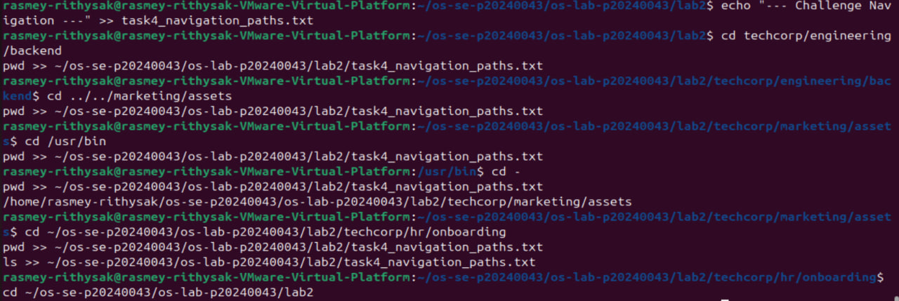
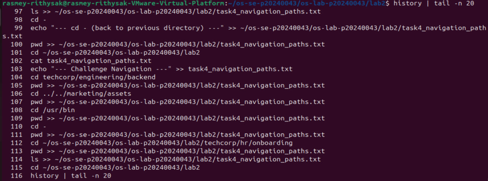
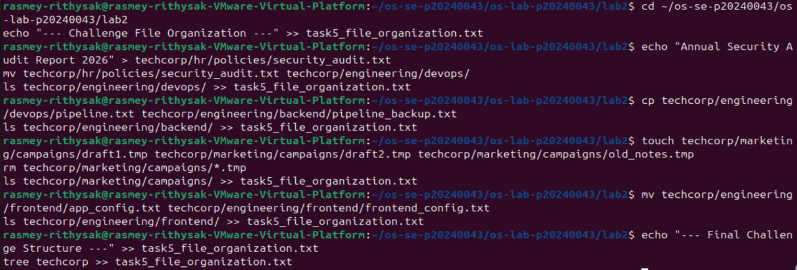
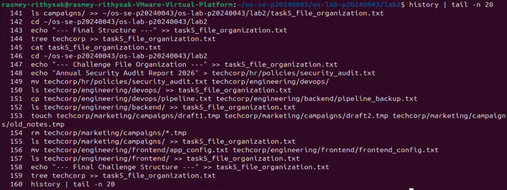
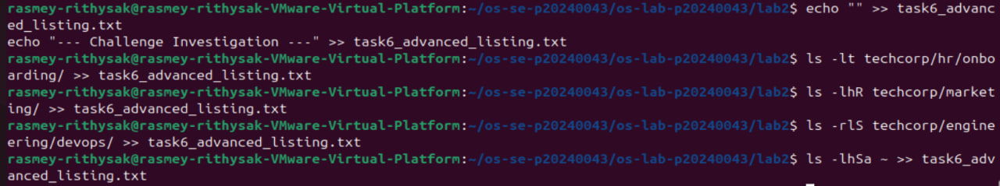
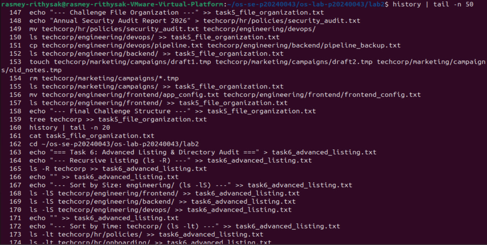
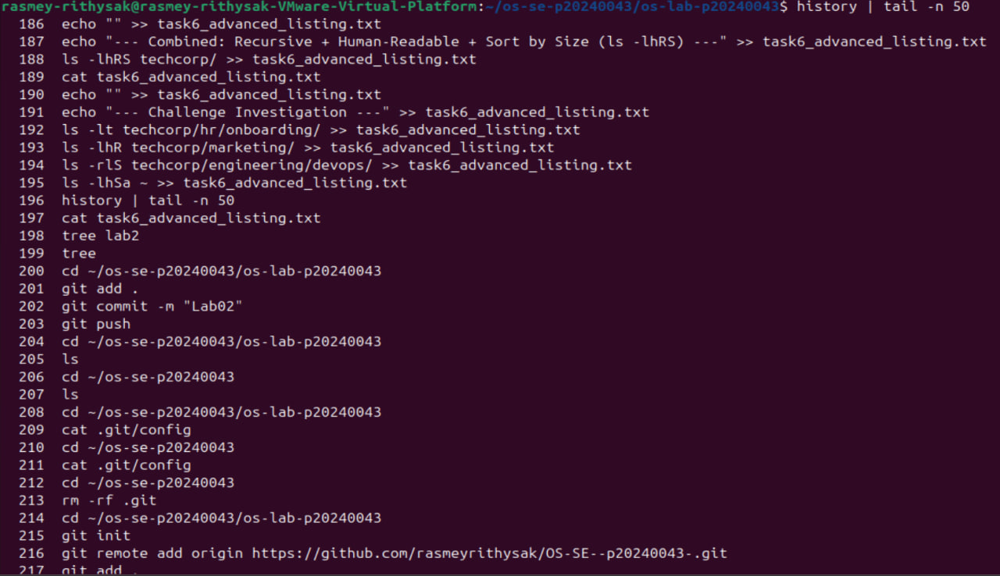

# OS Lab 2 Submission

- **Student Name:** Rasmey Rithysak
- **Student ID:** p20240043

---

## Task Output Files

During the lab, each task redirected its output into `.txt` files. These files are your primary proof of work for the **guided portions** of each task. Make sure all of the following files are present in your `lab2/` folder:

- `task1_basic_navigation.txt`
- `task2_filesystem_exploration.txt`
- `task3_directory_structure.txt`
- `task4_navigation_paths.txt`
- `task5_file_organization.txt`
- `task6_advanced_listing.txt`

---

## Screenshots

### Screenshot 1 — Task 4 Challenge Commands

---

### Screenshot 2 — Task 4 Challenge History

---

### Screenshot 3 — Task 5 Challenge Commands

---

### Screenshot 4 — Task 5 Challenge History

---

### Screenshot 5 — Task 6 Challenge Commands

---

### Screenshot 6 — Task 6 Challenge History

---

### Screenshot 7 — Full Command History
