# OS Lab 3 Submission — Wildcards, Links, GRUB & Shared Libraries

* Student Name: Rasmey Rithysak
* Student ID: p20240043
* Partner Name (Task 5): <Ouk Puthirith>
* Partner ID (Task 5): <p20240033>

## Task Output Files

* `task1_wildcards.txt`
* `task2_links.txt`
* `task3_grub.txt`
* `task4_shared_objects.txt`
* `task5_shared_library.txt`
* `task_history.txt`

## Screenshots

### Screenshot 1 — Task 1 Challenge: Wildcards
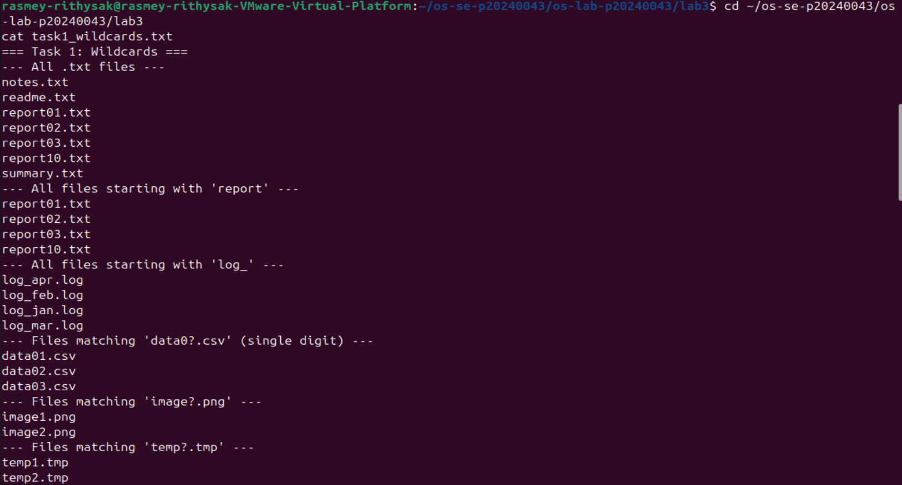

### Screenshot 2 — Task 2 Challenge: Links
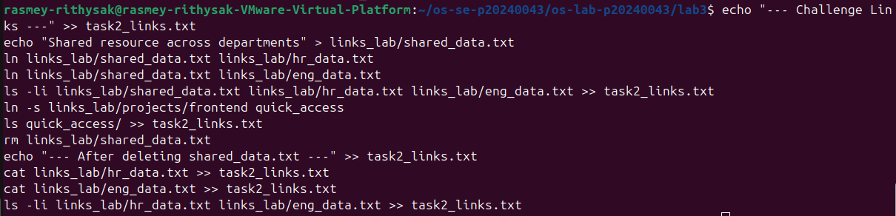

### Screenshot 3 — Task 3 Part B: VM Snapshot
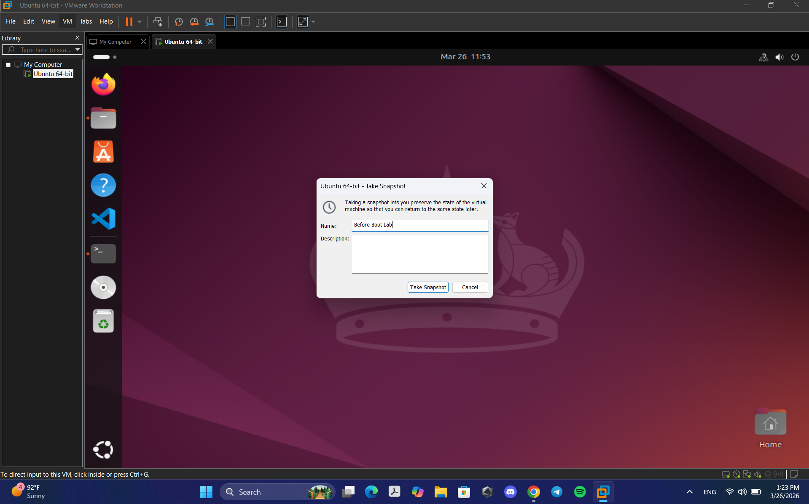

### Screenshot 4 — Task 3 Part B: GRUB Timeout Config
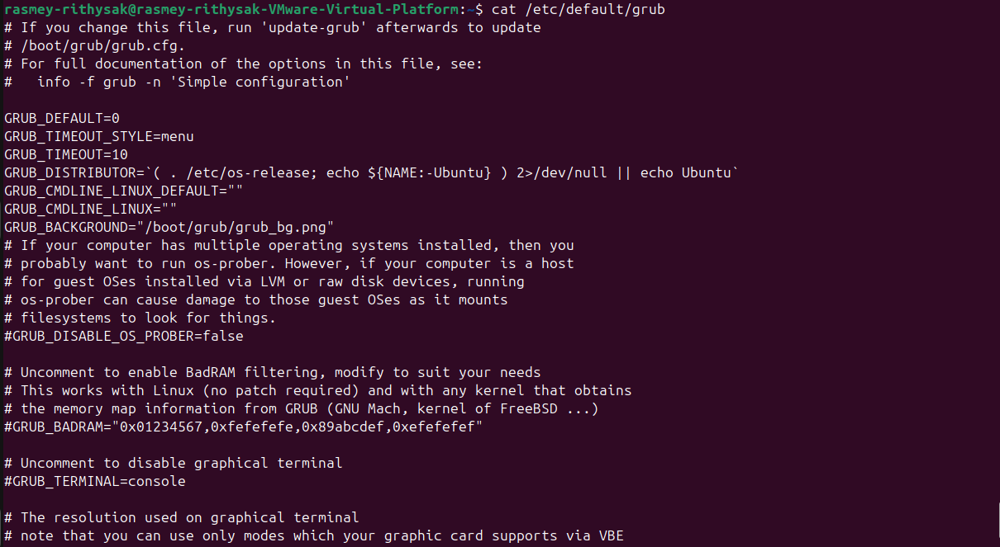

### Screenshot 5 — Task 3 Part B: Custom GRUB Entry
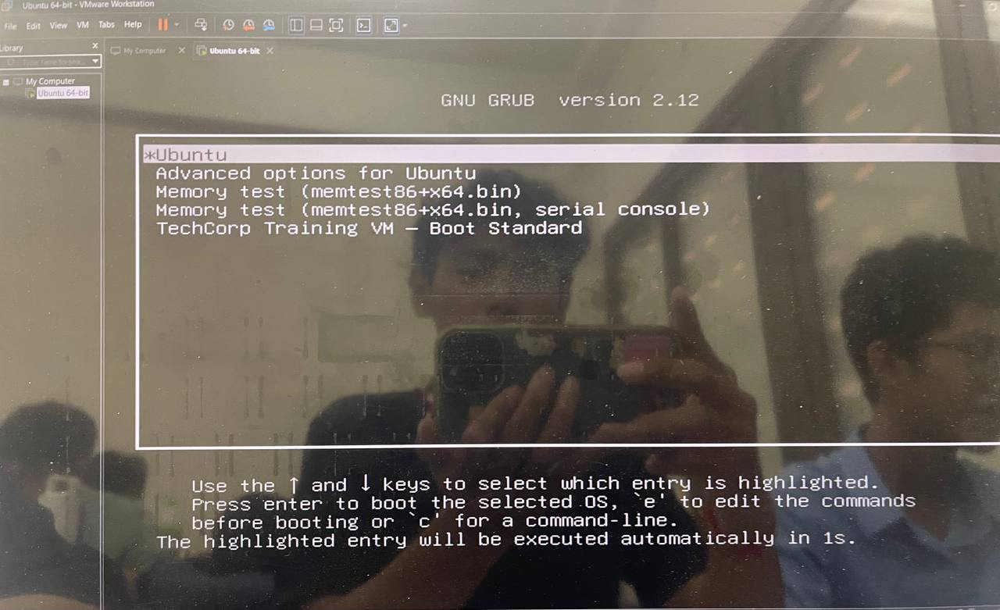

### Screenshot 6 — Task 3 Part B: GRUB Background Image
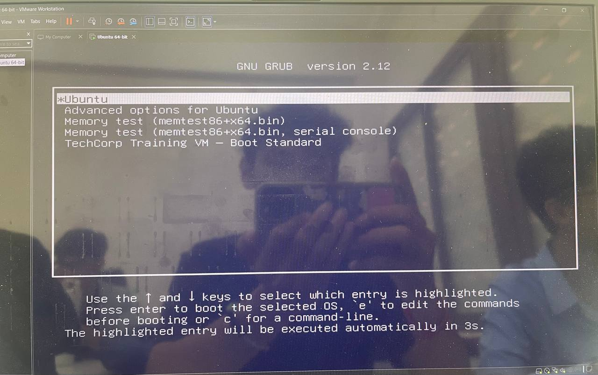

### Screenshot 7 — Task 3 Part C: Recovery Mode
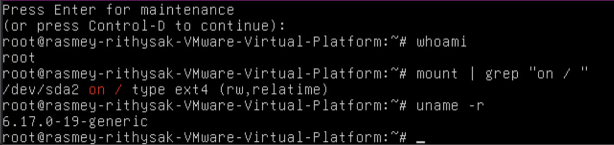

### Screenshot 8 — Task 3 Part C: Broken GRUB
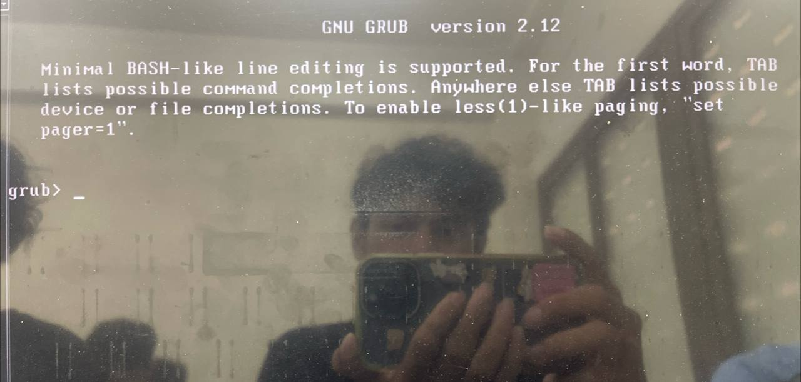

### Screenshot 9 — Task 3 Part C: Manual Boot
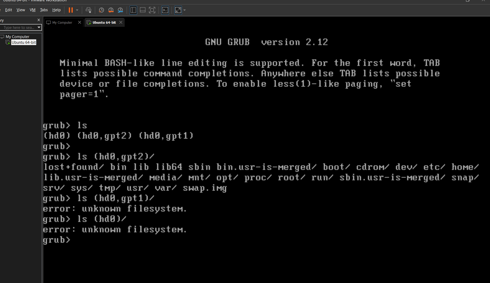

### Screenshot 10 — Task 3 Part C: Restored & Normal Boot
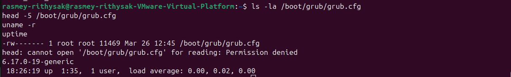

### Screenshot 11 — Task 3 Challenge: GRUB Customization
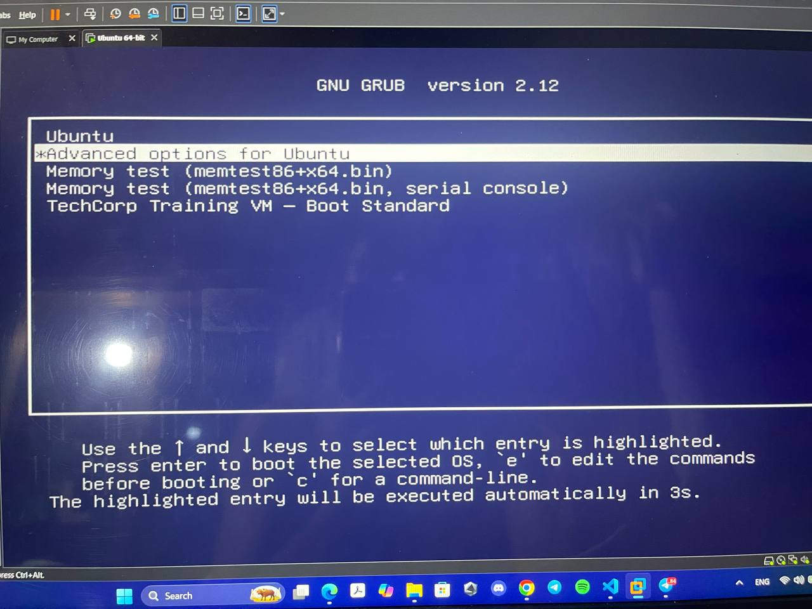

### Screenshot 12 — Task 4 Challenge: Shared Objects
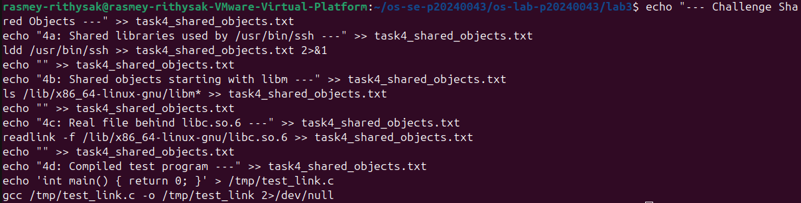

### Screenshot 13 — Task 5: Pair API Design
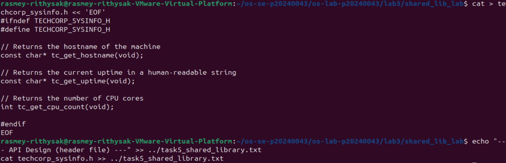

### Screenshot 14 — Task 5: Pair Integration Test
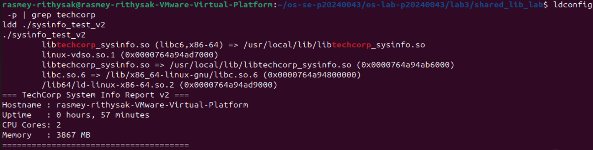

### Screenshot 15 — Full Command History
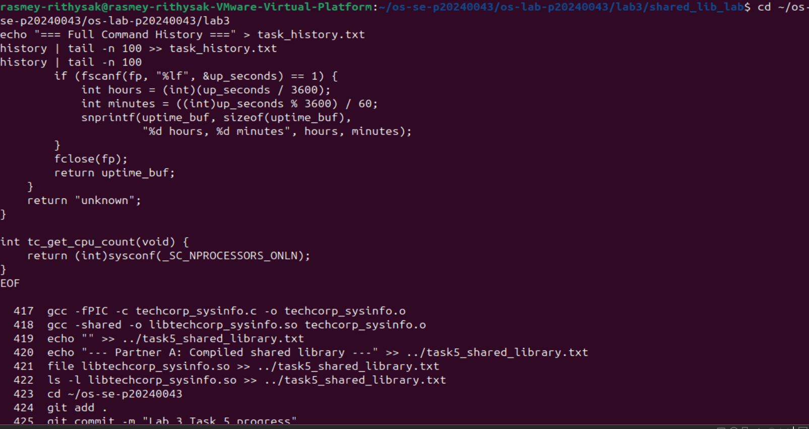
