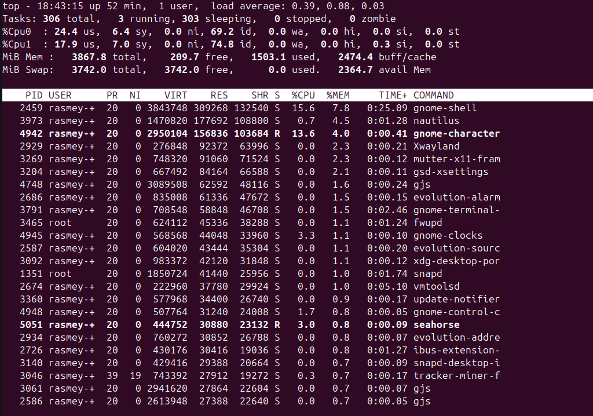
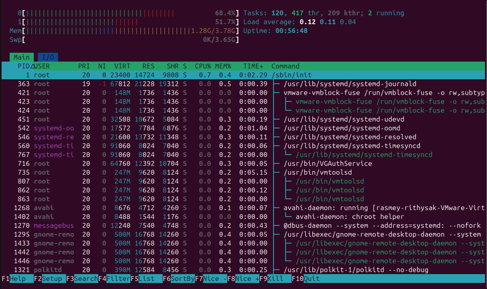
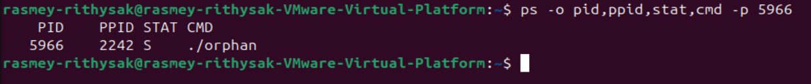
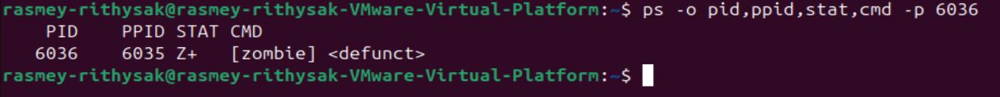

# Lab 4 — I/O Redirection, Pipelines & Process Management

| | |
|---|---|
| **Student Name** | Rasmey Rithysak |
| **Student ID** | p20240043 |

## Task Completion

| Task | Output File | Status |
|------|-----------|--------|
| Task 1: I/O Redirection | `task1_redirection.txt` | ✅ |
| Task 2: Pipelines & Filters | `task2_pipelines.txt` | ✅ |
| Task 3: Data Analysis | `task3_analysis.txt` | ✅ |
| Task 4: Process Management | `task4_processes.txt` | ✅ |
| Task 5: Orphan & Zombie | `task5_orphan_zombie.txt` | ✅ |

## Screenshots

### Task 4 — `top` Output

### Task 4 — `htop` Tree View

### Task 5 — Orphan Process (`ps` showing PPID = 1)

### Task 5 — Zombie Process (`ps` showing state Z)

## Answers to Task 5 Questions

1. **How are orphans cleaned up?**
   > Orphans are adopted by init/systemd (PID 1), which becomes their new parent and handles cleanup when they finish.

2. **How are zombies cleaned up?**
   > Zombies are cleaned up when the parent calls wait() to read the child's exit status, or when the parent itself dies and init cleans up the remaining zombie.

3. **Can you kill a zombie with `kill -9`? Why or why not?**
   > No. A zombie is already dead — it has no running code to kill. SIGKILL has nothing to act on. The only way to remove it is for the parent to call wait() or for the parent to die.

## Reflection

> Pipelines and redirection are incredibly useful for real server environments. Instead of scrolling through endless terminal output, you can filter, sort, and save exactly what you need. For example, combining grep, awk, and sort to analyze log files in real time is something I would use daily as a sysadmin. Understanding process management and signals is also critical — knowing when to use SIGTERM vs SIGKILL and how to handle orphan and zombie processes helps maintain a stable and clean server environment.
