# OS Lab 6 Submission — Linux Security, Users, Groups & File Permissions

* **Student Name:** Rasmey Rithysak
* **Student ID:** p20240043
* **Course:** Operating Systems
* **Lab Title:** Linux Security: Users, Groups & File Permissions
* **Date:** 2026-05-28

---

## Task Output Files

Make sure all of the following files are present in your `lab6/` folder:

* `task1_users.txt`
* `task2_groups.txt`
* `task3_permissions.txt`
* `task3_stat_output.txt`
* `task4_special_bits.txt`
* `task5_acl.txt`
* `security_lab/whoami_suid.c`

---

## Screenshots

### Screenshot 1 — Task 1: User Creation
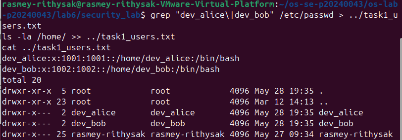

Show `cat task1_users.txt` confirming both `dev_alice` and `dev_bob` accounts exist.

### Screenshot 2 — Task 1: User Modification
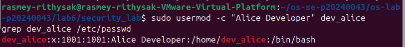

Show the updated `/etc/passwd` entry for `dev_alice` with the GECOS comment field.

### Screenshot 3 — Task 2: Group Setup
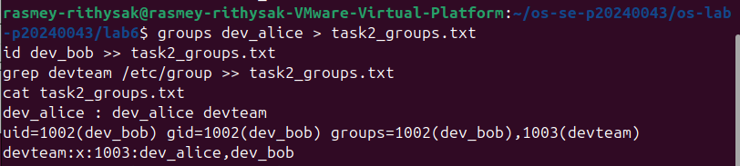

Show `cat task2_groups.txt` with group membership for both users.

### Screenshot 4 — Task 2: Multiple Group Membership
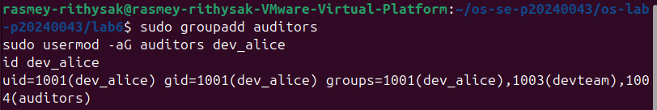

Show `id dev_alice` confirming membership in both `devteam` and `auditors`.

### Screenshot 5 — Task 3: Directory Permissions
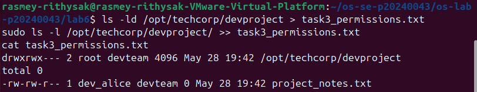

Show `cat task3_permissions.txt` with `drwxrwx---` on the project directory.

### Screenshot 6 — Task 3: Access Denied
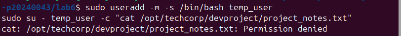

Show the `Permission denied` error when `temp_user` tries to access the project directory.

### Screenshot 7 — Task 4: setgid Bit
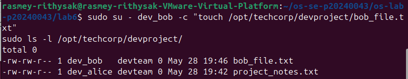

Show the directory listing with `s` in the group execute position, and `bob_file.txt` inheriting the `devteam` group.

### Screenshot 8 — Task 4: Sticky Bit
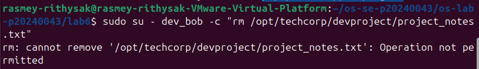

Show the `t` bit in the directory listing and the `Operation not permitted` error when `dev_bob` tries to delete `dev_alice`'s file.

### Screenshot 9 — Task 4: setuid Bit
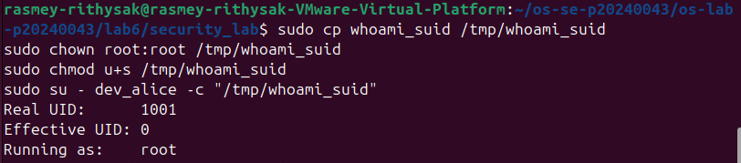

Show `ls -l whoami_suid` with `s` in the owner execute position and the program's UID output showing Effective UID as 0 (root).

### Screenshot 10 — Task 5: ACL Directory
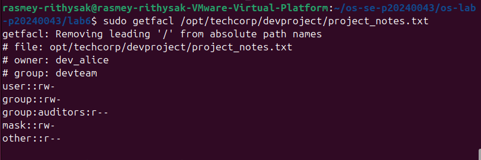

Show `getfacl /opt/techcorp/devproject` with the `auditors` ACE entry `group:auditors:r-x`.

### Screenshot 11 — Task 5: ACL Access Test
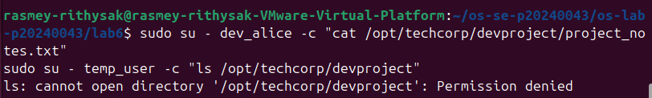

Show `dev_alice` successfully accessing the file and `temp_user` being denied.

### Screenshot 12 — Task 5: ACL Output File
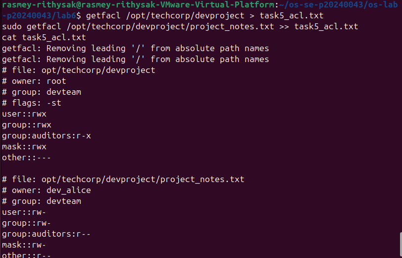

Show `cat task5_acl.txt` with the full ACL entries for both the directory and the file.

---

## Answers to Lab Questions

### 1. What is the difference between `userdel` and `userdel -r`?

`userdel` removes only the user account entry from `/etc/passwd`, `/etc/shadow`, and `/etc/group`. The user's home directory and all their personal files remain on disk untouched. This can leave orphaned files behind that are owned by a now-deleted UID.

`userdel -r` does everything `userdel` does but additionally deletes the user's home directory (e.g. `/home/dev_alice`) and their mail spool. This is the cleaner option when you want to fully remove a user and all their associated data from the system. You should be careful with `-r` because the deletion is permanent and cannot be undone.

### 2. Why is it safer to use `visudo` instead of directly editing `/etc/sudoers`?

`visudo` opens the sudoers file in a controlled way and performs a syntax check before saving any changes. If you introduce a typo or invalid rule, `visudo` will warn you and give you the option to fix it before writing the file. This prevents a broken sudoers file from being saved.

If you edit `/etc/sudoers` directly with a regular text editor like `nano` and accidentally introduce a syntax error, the file gets saved with the broken syntax. This can completely disable `sudo` on the system, potentially locking you out of administrative access — especially dangerous on a remote server where you have no other way in.

### 3. What happens when a `setgid` directory contains files created by different users? What benefit does this provide for team collaboration?

When the `setgid` bit is set on a directory, any new file or subdirectory created inside it automatically inherits the group ownership of the parent directory, regardless of which user created it. In our lab, even though `dev_bob` created `bob_file.txt`, it was automatically assigned to the `devteam` group because the `devproject` directory has setgid set.

Without setgid, files would inherit the primary group of the user who created them, meaning `dev_bob`'s files would belong to the `dev_bob` group, and `dev_alice`'s files would belong to the `dev_alice` group. Other team members would have no group-level access to each other's files. With setgid, all files in the shared directory consistently belong to `devteam`, so every team member has the same level of access to all files in the directory without needing manual `chown` or `chmod` after every file creation.

### 4. What limitation of standard Unix permissions does the ACL system solve?

Standard Unix permissions follow a rigid three-tier model: owner, group, and others. Every file can only have one owner and one group. This becomes a problem when you need more nuanced access control — for example, granting read access to a specific second group without changing the file's primary group, or giving one specific user extra permissions without adding them to the group.

In our lab, the `devproject` directory was already owned by the `devteam` group. We needed to give the `auditors` group read access without changing the group owner or opening it up to everyone. Standard permissions cannot express this — you would have had to either change the group owner (losing devteam access) or open it to all others (a security risk). ACLs solve this by allowing additional permission entries for any number of specific users or groups on top of the standard permission set, giving administrators fine-grained control that the traditional Unix model cannot provide.
