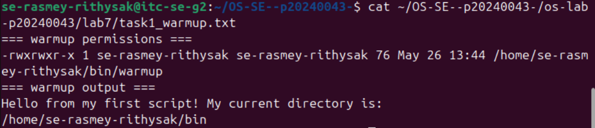
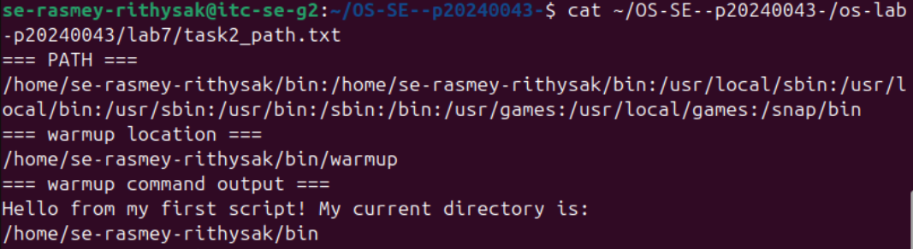
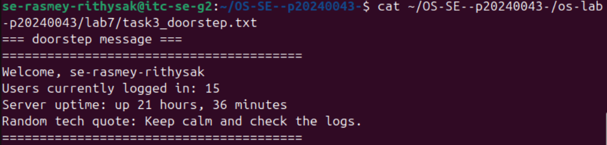
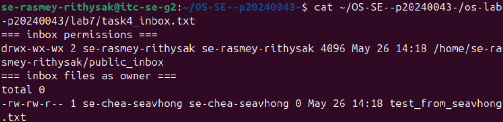
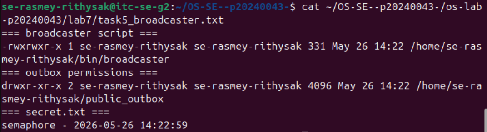
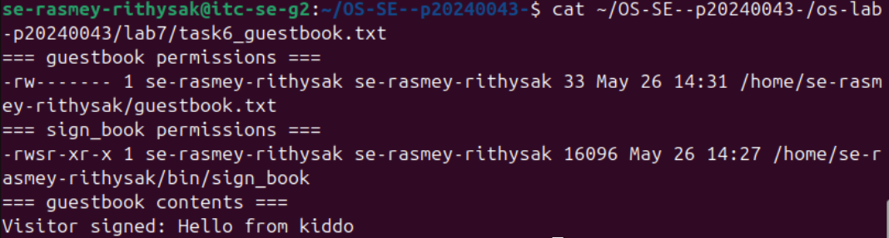
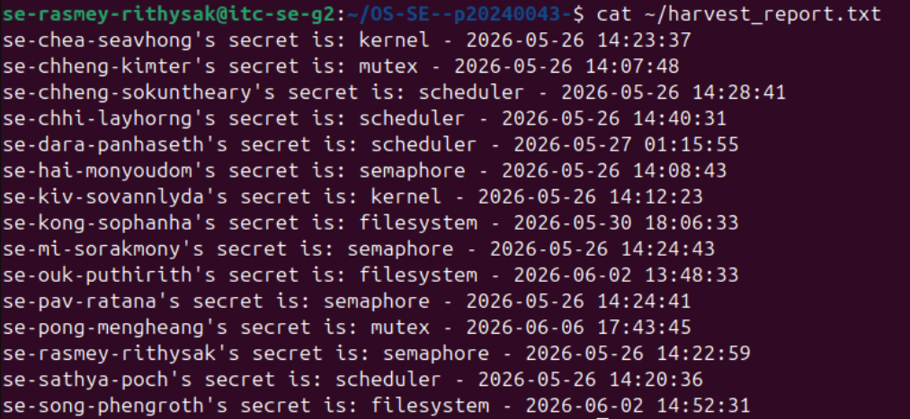
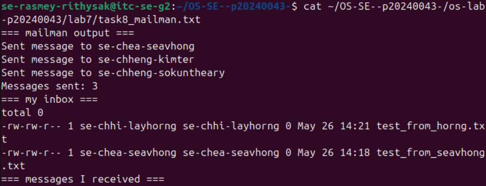

# OS Lab 7 Submission — Bash Scripting, Permissions & Server Automation

* Student Name: Rasmey Rithysak
* Student ID: p20240043

## Task Output Files

Make sure all of the following files are present in your `lab7/` folder:

* `task1_warmup.txt`
* `task2_path.txt`
* `task3_doorstep.txt`
* `task4_inbox.txt`
* `task5_broadcaster.txt`
* `task6_guestbook.txt`
* `harvest_report.txt`
* `task8_mailman.txt`
* `sign_book.c`
* `scripts/warmup`
* `scripts/broadcaster`
* `scripts/harvester`
* `scripts/mailman`
* `scripts/sign_book_binary`

## Screenshots

### Screenshot 1 — Task 1: Warm-Up Script

### Screenshot 2 — Task 2: PATH Setup

### Screenshot 3 — Task 3: Doorstep Message

### Screenshot 4 — Task 4: Secure Mailbox

### Screenshot 5 — Task 5: Broadcaster

### Screenshot 6 — Task 6: VIP Guestbook

### Screenshot 7 — Task 7: Data Harvester

### Screenshot 8 — Task 8: Mailman Bot

## Answers to Lab Questions

1. **Why did `warmup` fail before you added execute permission?**  
Linux requires the execute (`x`) permission bit to be set before a file can be run as a program. Without `chmod +x`, the kernel refuses to execute it and returns "Permission denied".

2. **What does adding `~/bin` to `PATH` allow you to do?**  
It lets you run scripts in `~/bin` by just typing their name from anywhere, without needing `./` or the full path.

3. **Why does `chmod 733 public_inbox` allow classmates to drop files but not list the inbox?**  
Permission `733` gives others write and execute but not read. Execute allows entering the directory and creating files, but without read they cannot list or see existing files inside.

4. **Why does Linux ignore SUID on shell scripts, and why did we use a compiled C program instead?**  
Linux ignores SUID on scripts for security reasons — scripts can be modified easily and the interpreter adds complexity. A compiled C binary runs directly, so the kernel can safely apply SUID and run it as the file owner.

5. **What is the difference between `>` and `>>` in Bash redirection?**  
`>` overwrites the file with new content. `>>` appends to the end of the file without deleting existing content.

6. **How did your `harvester` avoid reading files that were missing or not readable?**  
It used `[ -f "$target_file" ] && [ -r "$target_file" ]` to check that the file exists and is readable before trying to read it.

7. **What permission problems did you or your classmates need to fix during the lab?**  
Some classmates had the wrong username hardcoded in `sign_book.c`, causing "Error opening guestbook". They needed to fix the path and recompile. Also, home directory permissions needed `chmod 711` so classmates could traverse into `~/bin`.

## Reflection

This lab taught me how scripting, permissions, and automation work together on a shared Linux server. Setting up PATH, write-only inboxes, SUID binaries, and cross-user bots showed how Linux permissions protect users while still allowing controlled collaboration. Automating tasks like harvesting and sending messages also showed how powerful simple bash scripts can be in a real server environment.