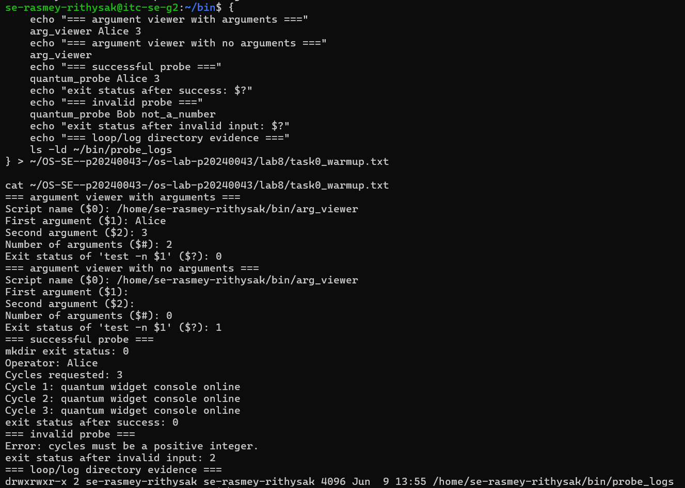
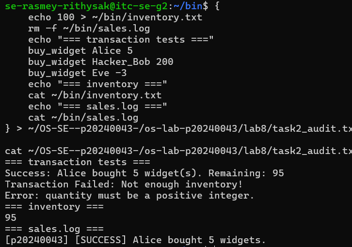
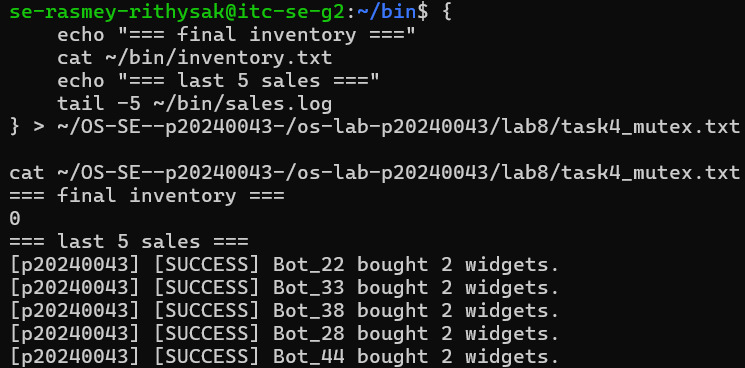
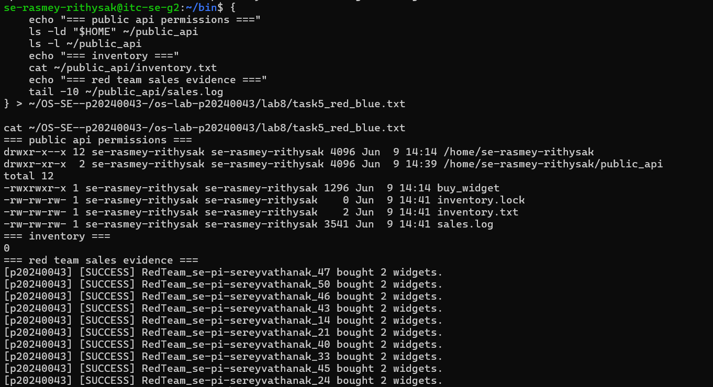
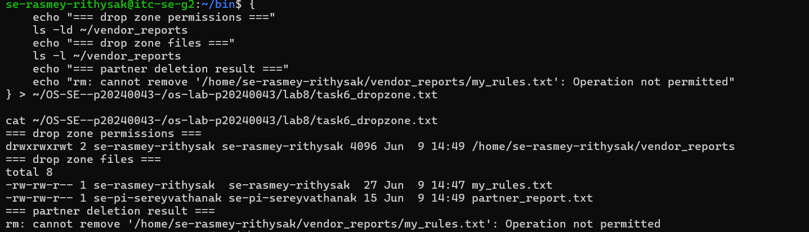
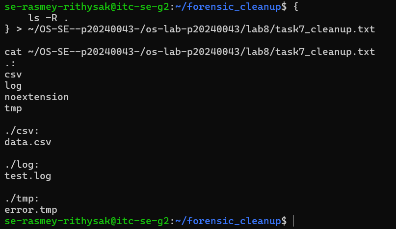

cat > ~/OS-SE--p20240043-/os-lab-p20240043/lab8/README.md << 'EOF'
# OS Lab 8 Submission - The Quantum Widget Exploit

| | |
|---|---|
| **Student Name** | Rasmey Rithysak |
| **Student ID** | p20240043 |
| **Partner Username** | Pi Sereyvathanak |

---

## Task Output Files

- [x] observations.txt
- [x] task0_warmup.txt
- [x] task1_validation.txt
- [x] task2_audit.txt
- [x] task4_mutex.txt
- [x] task5_red_blue.txt
- [x] task6_dropzone.txt
- [x] task7_cleanup.txt
- [x] scripts/arg_viewer
- [x] scripts/quantum_probe
- [x] scripts/buy_widget
- [x] scripts/bot_swarm
- [x] scripts/create_dropzone
- [x] scripts/cleanup

---

## Screenshots

### Screenshot 1 - Level 0: Bash Warm-Up Scripts

### Screenshot 2 - Level 2: Audit Trails

### Screenshot 3 - Level 4: Mutex Patch

### Screenshot 4 - Level 5: Red Team vs. Blue Team

### Screenshot 5 - Level 6: Secure Drop Zone

### Screenshot 6 - Level 7: Forensic Cleanup

---

## Race Condition Observations

| Run | Final Inventory | Notes |
|-----|----------------|-------|
| 1 | 88 | Suspicious - should be 0 |
| 2 | 86 | Suspicious - should be 0 |
| 3 | 86 | Suspicious - should be 0 |
| 4 | 90 | Suspicious - should be 0 |
| 5 | 90 | Suspicious - should be 0 |

---

## Answers to Lab Questions

**1. In arg_viewer, what did $0, $1, $2, $#, and $? mean when you ran the script?**

$0 is the name/path of the script itself. $1 and $2 are the first and second arguments passed on the command line. $# is the total number of arguments provided. $? is the exit status of the most recently run command — 0 means success, non-zero means failure. When I ran `arg_viewer Alice 3`, $0 was the script path, $1 was Alice, $2 was 3, $# was 2, and $? was 0 because `test -n $1` succeeded since $1 was not empty.

**2. What does TOC-TOU mean, and where did it appear in the vulnerable buy_widget script?**

TOC-TOU stands for Time-of-Check to Time-of-Use. It is a race condition where a program checks a shared resource and then uses it in two separate steps, with no guarantee the resource hasn't changed in between. In the vulnerable buy_widget, the check was `current=$(cat inventory.txt)` and the use was `echo "$new_inventory" > inventory.txt`. Because these were not atomic, another process could write to inventory.txt between those two lines, making the first process's calculation stale by the time it wrote back.

**3. Why did bot_swarm sometimes leave inventory values other than 0 before the patch?**

All 50 background processes launched almost simultaneously and many read inventory.txt before any other had finished writing. For example, 10 bots might all read 100, each compute 98, and all write 98 back — so only 2 units are deducted instead of 20. The final value depends on the OS scheduler's exact timing of context switches, which varies every run, producing a different wrong answer each time instead of the correct value of 0.

**4. What part of the script is the critical section, and why must it be protected?**

The critical section is the block that reads inventory.txt, checks stock availability, computes the new inventory, writes it back, and appends to sales.log. It must be protected because all four operations must appear atomic with respect to other processes. If two processes interleave inside this section they both act on the same stale inventory value, causing lost updates and an incorrect final count.

**5. How does flock -x enforce mutual exclusion between concurrent processes?**

flock -x requests an exclusive lock on a file descriptor attached to inventory.lock. The kernel enforces the lock: if one process already holds it, any other process calling flock -x on the same file blocks and waits until the lock is released. This serialises all processes through the critical section so only one at a time reads and writes the shared inventory file, preventing race conditions.

**6. Which permissions did you use to let a classmate run your API without giving full access to your home directory?**

- `chmod o+x $HOME` — lets others traverse the home directory without listing its contents
- `chmod 755 ~/public_api` — makes the API folder readable and traversable by all
- `chmod o+rx ~/public_api/buy_widget` — lets others read and execute the script
- `chmod o+rw ~/public_api/inventory.txt ~/public_api/sales.log ~/public_api/inventory.lock` — lets others read and write the shared data files the script needs

**7. Why does the sticky bit protect files in a shared drop zone?**

Normally in a world-writable directory anyone can delete any file regardless of ownership. The sticky bit changes this so only the file's owner, the directory's owner, or root can delete or rename a file. This means a partner can write their own files into the drop zone but cannot delete files owned by another user, as demonstrated when my partner got "Operation not permitted" trying to delete my_rules.txt.

**8. What defensive scripting practice from this lab would you use in a real production script?**

The most important practice is anchoring all file paths to the script's own directory using `script_dir="$(cd "$(dirname "${BASH_SOURCE[0]}")" && pwd)"`. This ensures the script always reads and writes the correct files regardless of where it is called from. Combined with strict input validation using regex and the flock critical section pattern, it makes the script safe to use in any environment and under concurrent access.

---

## Reflection

This lab taught me that Bash scripts do not run in isolation — they interact directly with the OS scheduler, the file system, and other processes. A script that works perfectly for one user can break badly when 50 processes run it at the same time, because the OS can context-switch between any two instructions. File permissions are not just about security from attackers but also about protecting shared resources from accidental corruption. The flock mutex showed me that safe concurrent access requires explicit OS-level coordination, not just careful coding. The sticky bit demonstrated that least privilege applies not just to who can read files but also to who can delete them.
EOF

echo "README.md created"
